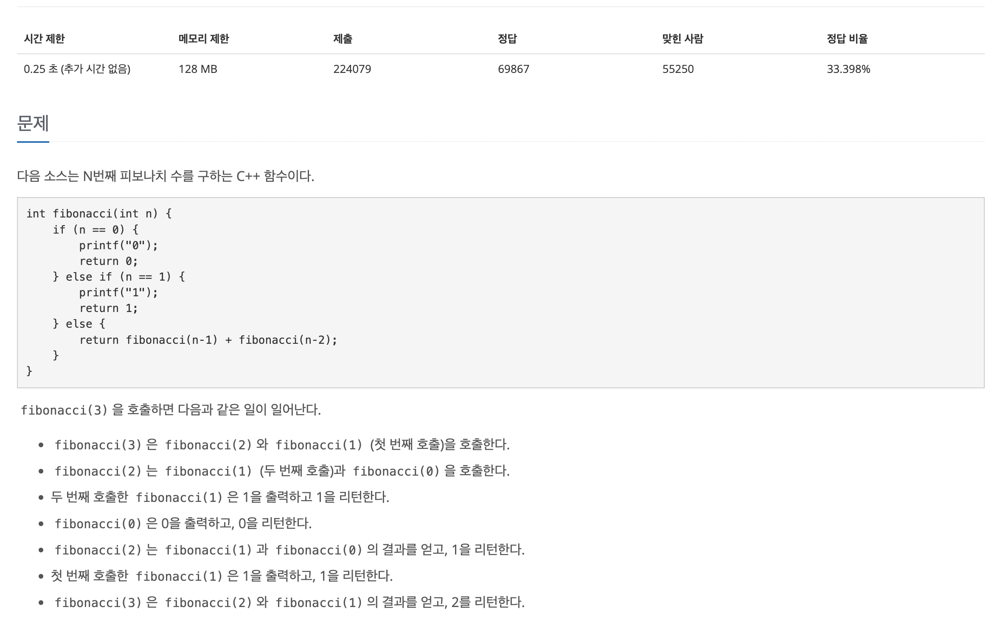
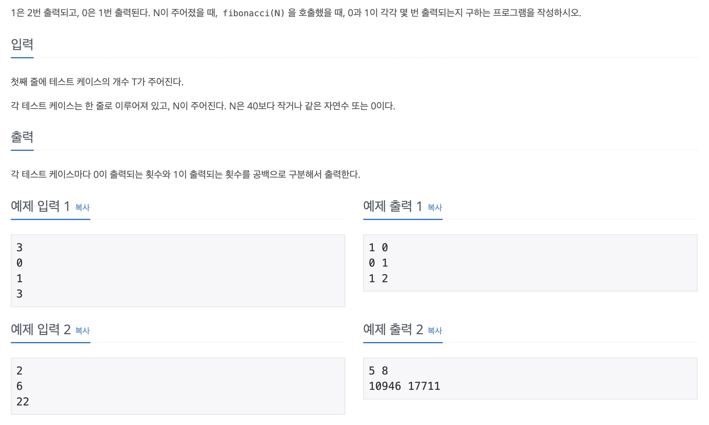

## 📖 [피보나치 함수](https://www.acmicpc.net/problem/1003)
#### 📍 문제

---
#### 📍 풀이
- 기본적인 DP를 이용한 풀이
---
#### 📍 느낀점
- 시간제한이 조금 까다로웠다. 처음에는 테스트 케이스마다 dp 배열을 새로 생성하여 풀었는데, 테스트 케이스를 먼저 모두 입력 받고, 입력받은 최대 숫자만큼의 배열을 생성하니 연산을 한번만 실행하면 돼서 해결할 수 있었다. 시간 조건을 꼼꼼히 고려하자.