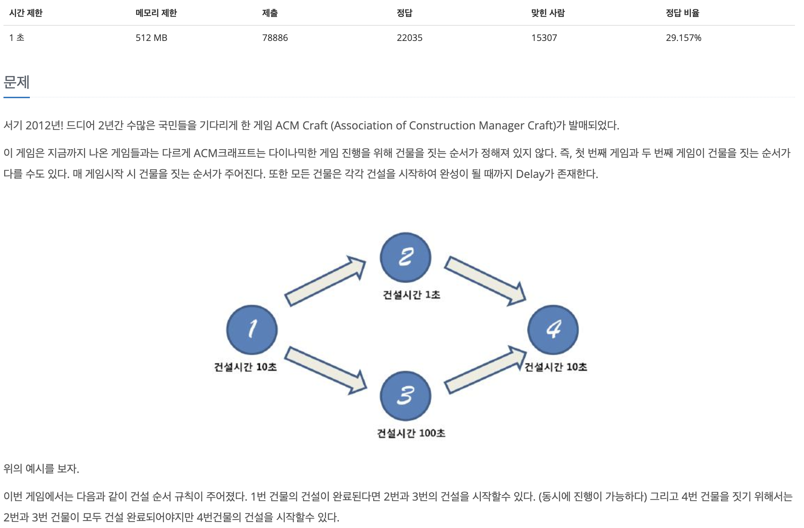
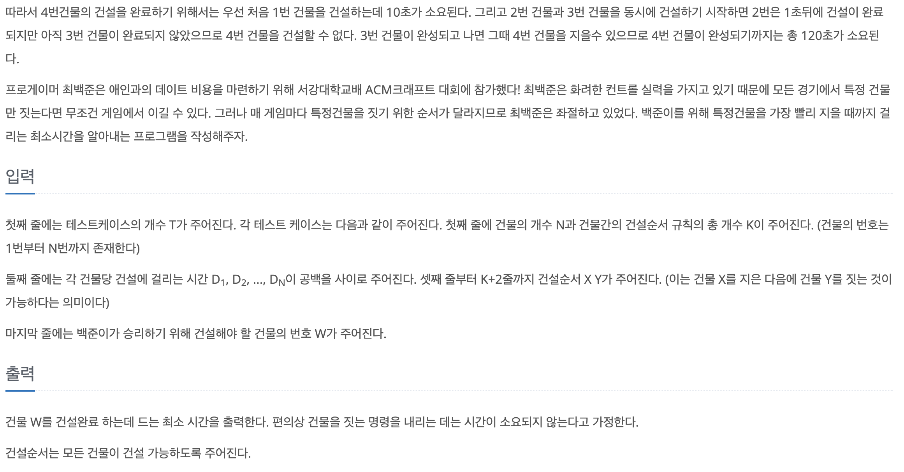
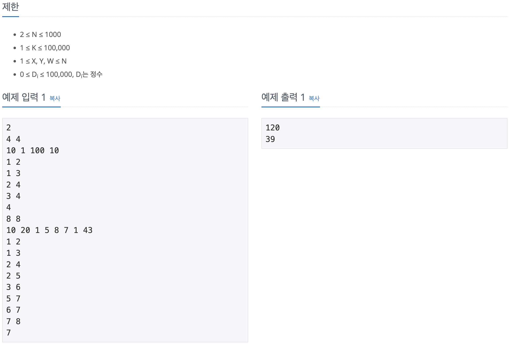

## 📖 [ACM Craft](https://www.acmicpc.net/problem/1005)
#### 📍 문제

---
#### 📍 풀이
- 기본적인 위상정렬과 DP를 이용한 풀이
- Queue를 이용한 위상정렬을 수행하며 노드를 하나씩 꺼내며 DP를 수행한다.
- 현재 노드에서 진출하는 모든 간선이 도달하는 노드 i에 대해 기존의 dp[i] 값과 (dp[curr] (현재 노드의 dp값) + D[i] (다음 노드 건물을 짓는 시간의 합))을 비교하여 최댓값을 저장한다.
---
#### 📍 느낀점
- 대놓고 위상정렬과 DP를 이용하라고 보여주는 문제라서 방법만 안다면 어렵지 않았다.