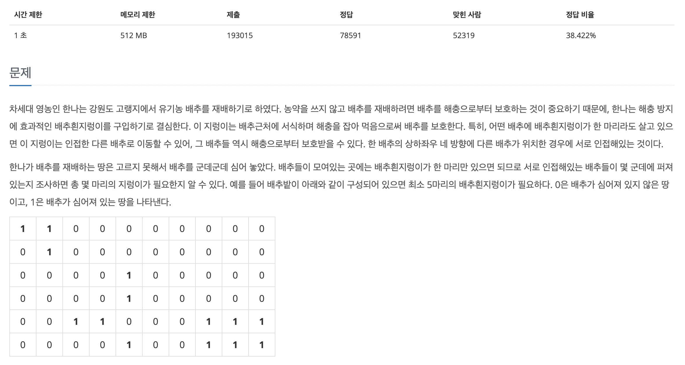
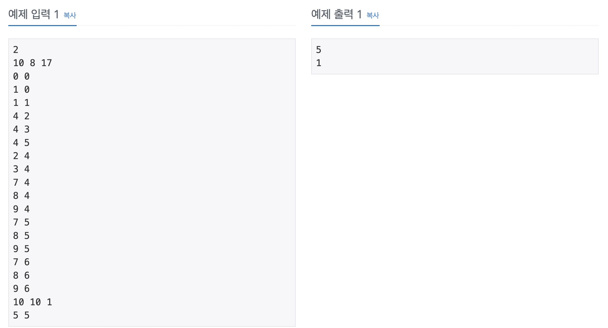
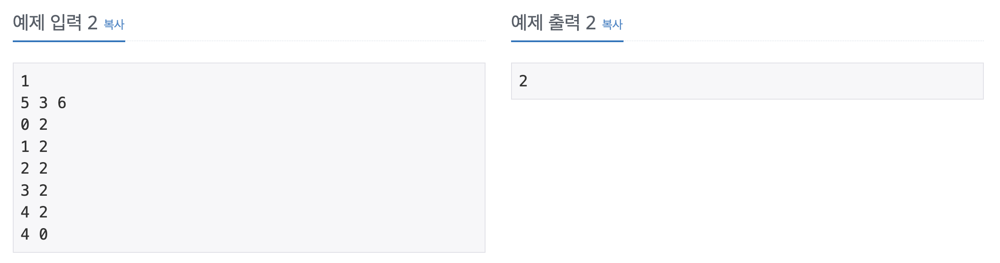

## 📖 [유기농 배추](https://www.acmicpc.net/problem/1012)
#### 📍 문제

---
#### 📍 풀이
- 배추의 인덱스를 저장할 객체를 inner Class로 생성하고, 해당 객체 타입의 Queue를 통해 BFS로 구현하였다.
- 배열을 순회하며 배추가 존재하면서 방문하지 않은 곳에서 BFS를 실행하여 인접한 배추의 visited를 모두 true로 만들었다.
- BFS가 한 번 실행될 때 마다 인접한 배추의 집합이 1개 씩 늘어나는 것이므로, 이를 구현했다.
---
#### 📍 느낀점
- BFS의 대표 문제답게 깔끔한 풀이가 가능했다.