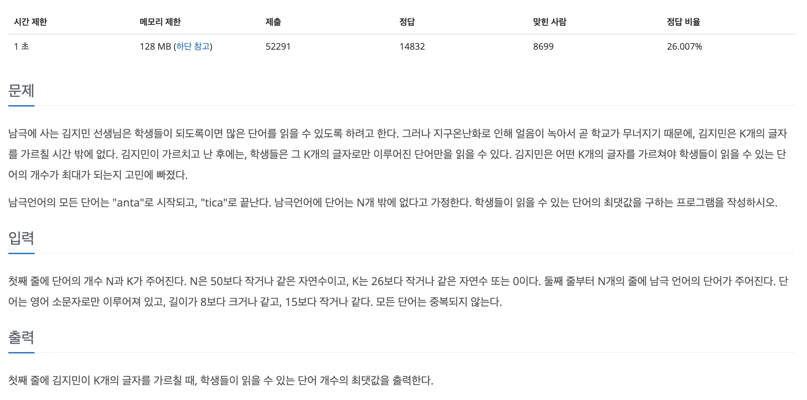
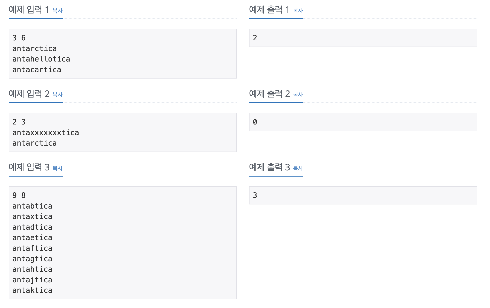

## 📖 [가르침](https://www.acmicpc.net/problem/1062)
#### 📍 문제

---
#### 📍 풀이
- 알파벳 'a', 'c', 'i', 'n', 't'는 항상 포함되므로 이를 제외한 중간 단어에서만 탐색하도록 했다.
- 필수로 포함되는 단어를 제외하고 추가로 몇개의 알파벳이 포함되어 있는지 저장하기 위해 단어는 Map 형식을 사용했고, 알파벳에 대해서는 중복을 방지하고, 빠르게 탐색하기 위해 Set 형식을 사용했다. 
- 조합을 이용하여 만들 수 있는 K-5개의 모든 경우에 따라 단어를 최대 몇개 읽을 수 있는지 결정했다.
---
#### 📍 느낀점
- 처음에 K가 전체 알파벳 개수보다 클 때의 경우를 고려하지 못했다. 조건이 까다로운 문제를 만나면 최대한 다양한 경우의 수를 생각해보자.
- 배열이나 List 형식을 사용해서 풀다가 반복문이 너무 많아져서 Map과 Set 형식을 사용하게 되었는데, 그래서인지 메모리가 많이 낭비된 것 같다.
- 최대한 불필요한 반복을 줄이기 위해 여러 조건을 쓰다보니 코드가 다소 지저분해졌다. 더 좋은 풀이가 무엇이 있을지 고민해봐야겠다.
- 그래도 해당 문제를 풀면서 Map과 Set 자료구조의 특징을 다시 한 번 상기시킬 수 있었고, 새로운 method나 반복문 구현 방법 등을 알게되었다.