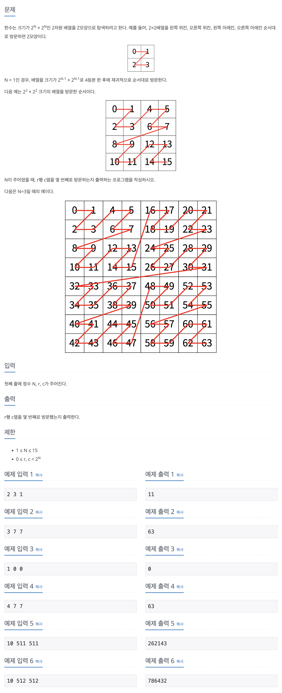

## 📖 [Z](https://www.acmicpc.net/problem/1074)
#### 📍 문제

---
#### 📍 풀이
- 분할정복을 이용한 탐색 풀이
- 사분면을 나누어서 재귀를 호출한다.
- `halfSize = 현재 배열 크기 N / 2` 라고 할 때
  - 1사분면 (오른쪽 위)
    - r의 위치는 고정, c의 위치는 현재 halfSize 만큼 감소
    - 2사분면을 모두 방문한 후에 방문할 수 있기 때문에 반환 값은 `호출한 N-1 재귀 값 + (halfSize * halfSize)` 이다.
  - 2사분면 (왼쪽 위)
    - r과 c의 위치 모두 고정
    - 가장 먼저 방문하는 사분면이기 때문에 반환값은 `호출한 N-1 재귀 값` 이다.
  - 3사분면 (왼쪽 아래)
    - r의 위치는 현재 halfSize 만큼 감소, c의 위치는 고정
    - 2사분면과 1사분면을 모두 방문한 후에 방문할 수 있기 때문에 반환값은 `호출한 N-1 재귀 값 + 2 * (halfSize * halfSize)` 이다.
  - 4사분면 (오른쪽 아래)
    - r과 c의 위치 모두 현재 halfSize 만큼 감소
    - 2사분면, 1사분면, 3사분면을 모두 방문한 후에 가장 마지막으로 방문하는 사분면이기 때문에 반환값은 `호출한 N-1 재귀 값 + 3 * (halfSize * halfSize)` 이다.
---
#### 📍 느낀점
- 처음에 사분면을 나누어서 생각하지 못해서 분할정복 문제인 것을 알고 있음에도 해결에 시간이 많이 소요되었다.