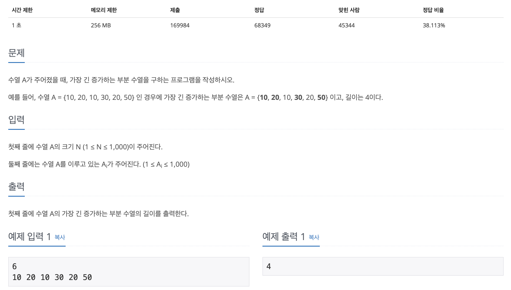

## 📖 [가장 긴 증가하는 부분 수열](https://www.acmicpc.net/problem/11053)
#### 📍 문제

---
#### 📍 풀이
- 기본적인 DP를 이용한 풀이
---
#### 📍 느낀점
- 아직 DP에 대해 완벽히 이해하지는 못했지만 해당 문제에서 왜 DP를 사용하는지에 대한 감을 익힐 수 있었다. 테이블과 반복문 설계가 가장 중요한 것 같은데 그 부분이 어렵다.