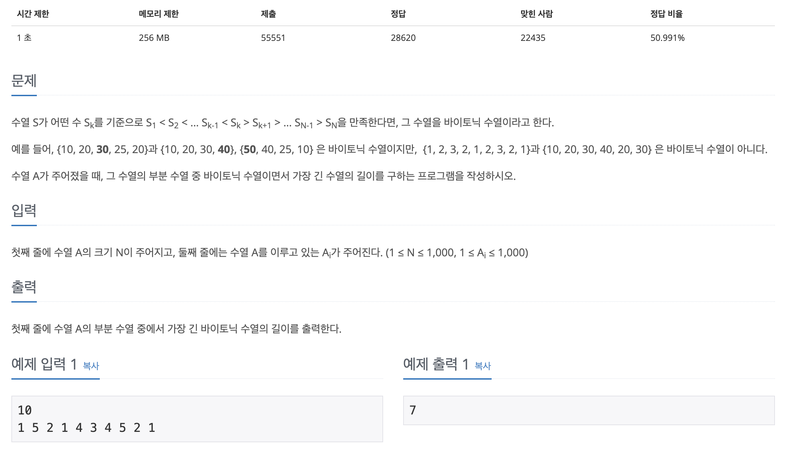

## 📖 [가장 긴 바이토닉 부분 수열](https://www.acmicpc.net/problem/11054)
#### 📍 문제

---
#### 📍 풀이
- 0 ~ i 증가하는 부분 수열 계산
- i ~ N 감소하는 부분 수열 계산
- 두 결과를 더한 값에서 1을 뺀 값이 (i번째 중복 제거) 해당 지점에서 바이토닉 부분 수열 
---
#### 📍 느낀점
- dp 하나로 풀 수 있는 방법이 없을까 무척 오래 고민했는데 생각보다 쉬운 문제라서 허무했다.. 