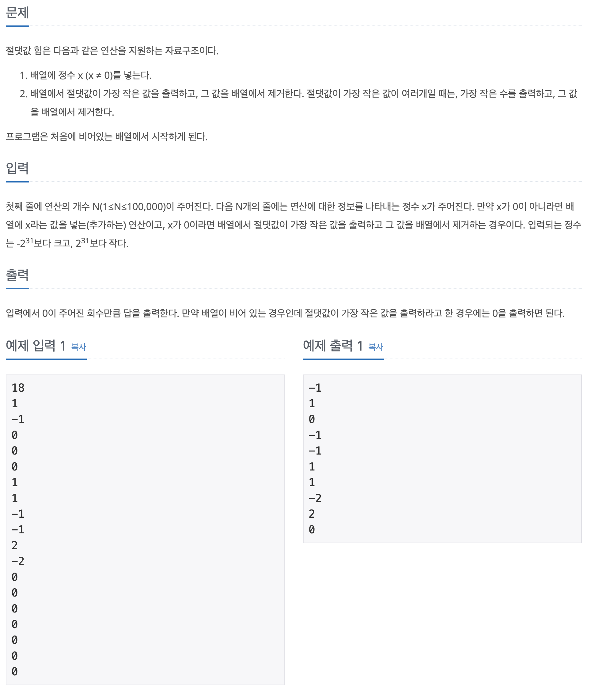

## 📖 [절댓값 힙](https://www.acmicpc.net/problem/11286)
#### 📍 문제

---
#### 📍 풀이
- 기본적인 우선순위 큐의 정렬을 이용한 자료구조 문제
---
#### 📍 느낀점
- 오랜만에 객체에 Comparator를 구현하여 정렬했는데, 기억이 잘 나지 않는 부분이 있었다. 자동완성이 되지 않을 때 실수하지 않고 정확히 구현하는 연습을 해야겠다.