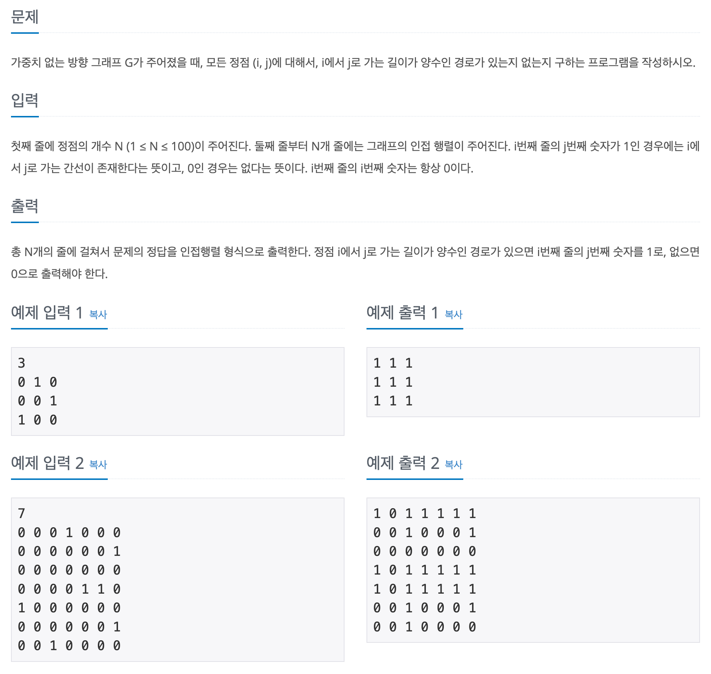

## 📖 [경로 찾기](https://www.acmicpc.net/problem/7662)

---
#### 📍 풀이
- 플로이드-워셜 알고리즘
- 경로의 존재 여부만 판단하면 되어서 플로이드-워셜 문제에서 최솟값 구하는 부분만 변경하면 된다.
---
#### 📍 느낀점
- 반복문 순서에 주의해야 한다.
  - h번 노드를 거쳐가는 모든 경우에 대해 판단해야 하므로 3중 for문의 구조는 h -> r -> c 가 된다.
  - 이 것 때문에 많이 헤맸다.. 