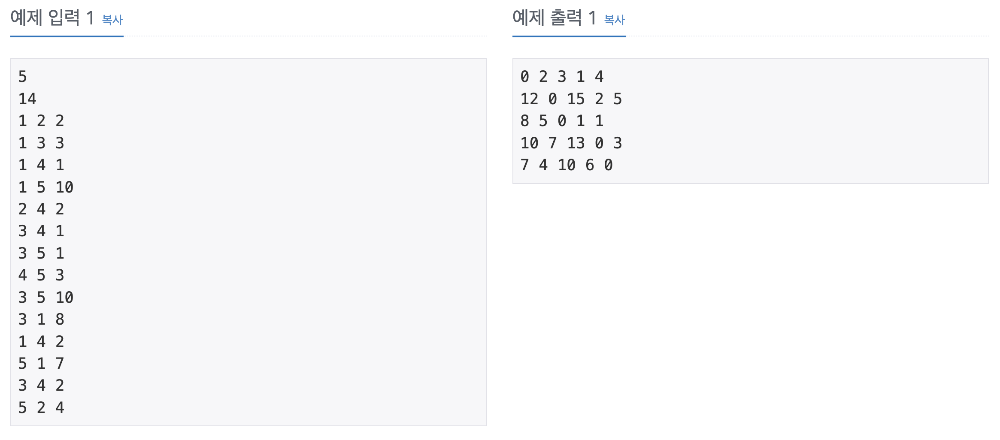

## 📖 [플로이드](https://www.acmicpc.net/problem/11404)
#### 📍 문제

---
#### 📍 풀이
- 기본적인 플로이드-워셜 알고리즘을 이용한 풀이
---
#### 📍 느낀점
- 코드 구현도 짧고, 다익스트라와 DP를 이해하고 있으면 쉬운 알고리즘이라고 느꼈다.
- Arrays.fill(arr, Integer.MAX_VALUE)를 사용할 수 없음에 주의하자. (+1 or -1이 연산되면 부호 바뀜) 최소/최대값을 입력할 때 문제의 조건 범위보다 크거나 작은 정수를 직접 입력하는 것이 좋다. 
- 문제 조건도 꼼꼼히 읽자! i->j 갈 수 없는 경우 0을 출력한다는 조건을 처음에 간과하고 풀었다. 