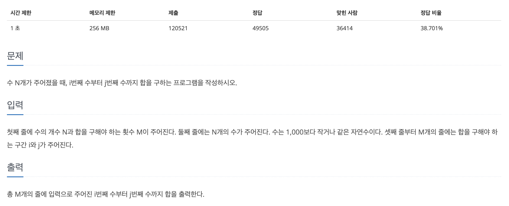

## 📖 [구간 합 구하기 4](https://www.acmicpc.net/problem/11659)
#### 📍 문제

---
#### 📍 풀이
- (i번 ~ j번 숫자의 합) = (1번 ~ j번 숫자의 합) - (1번 ~ i-1번 숫자의 합)
---
#### 📍 느낀점
- 처음에 매우 간단한 문제인 줄 알고 시간 복잡도를 고려하지 못했다. 누적합 기억하기! 