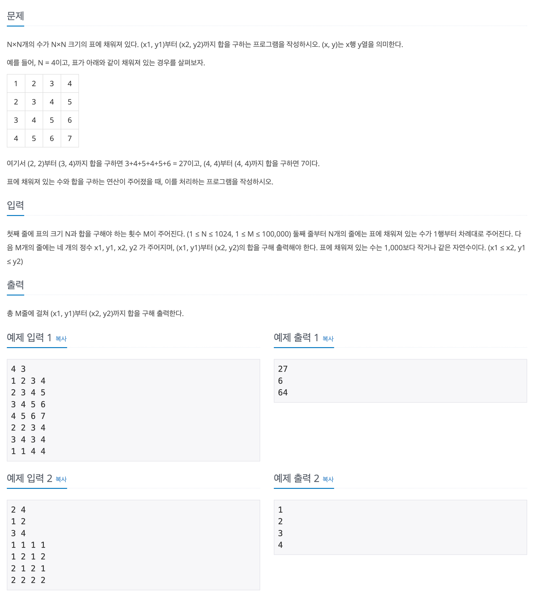

## 📖 [구간 합 구하기 5](https://www.acmicpc.net/problem/11660)

---
#### 📍 풀이
- 누적 합을 이용한 풀이
  - 2차원 배열에 `(1, 1)`부터 `(r, c)`까지의 누적 합을 계산해 저장한다. (계산식 : `arr[r][c] = num + arr[r][c - 1] + arr[r - 1][c] - arr[r - 1][c - 1]`)
  - 이후 같은 방식을 활용해 `(x1, y1)`부터 `(x2, y2)`까지의 구간 합을 구한다. (계산식 : `arr[x2][y2] - (arr[x1 - 1][y2] + arr[x2][y1 - 1] - arr[x1 - 1][y1 - 1])`)
- 실수
  - 2차원 배열의 크기를 `N * N`으로 설정했더니 경계면에서의 조건 처리를 해줘야 해서 코드가 복잡해지고 index error가 발생했다.
  - `(N + 1) * (N + 1)`로 하면 구간합을 구할 때 굳이 노드에 1을 뺄 필요가 없고 경계면에서의 처리도 훨씬 쉬워진다.
---
#### 📍 느낀점
- 누적 합을 이용한 문제라고 해서 계산이 더 깔끔하게 떨어질 줄 알았는데 처음 생각한 풀이가 맞아서 허무했다.
- 일단 점화식이 떠오르면 그 풀이가 맞는 문제가 많은 것 같다.