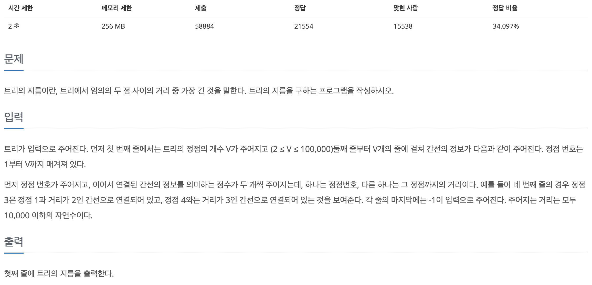
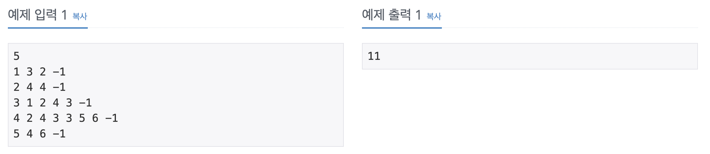

## 📖 [트리의 지름](https://www.acmicpc.net/problem/1167)
#### 📍 문제

---
#### 📍 풀이
- 임의의 한 점에서 BFS를 이용해 가장 거리가 먼 지점 max_node 를 구한다.
- 다시 점 max_node에서 BFS를 실행하여 가장 먼 거리를 구한 것이 답이다.
- Why?
  - 트리는 사이클이 존재하지 않고, 한 정점에서 다른 정점으로 가는 경로가 유일하다. 거리가 가장 먼 두 점 사이의 경로 또한 항상 유일하다.
  - 따라서 트리의 임의의 한 점에서 거리가 가장 먼 지점은 항상 트리의 지름을 이루고 있다. 해당 지점을 구한 후, 다시 그 지점으로부터 거리가 가장 먼 점을 구하면 그 두 점 사이의 거리가 트리의 지름이 된다. 
---
#### 📍 느낀점
- 트리를 이해하는 중요한 이론같다.. 외워야겠다.