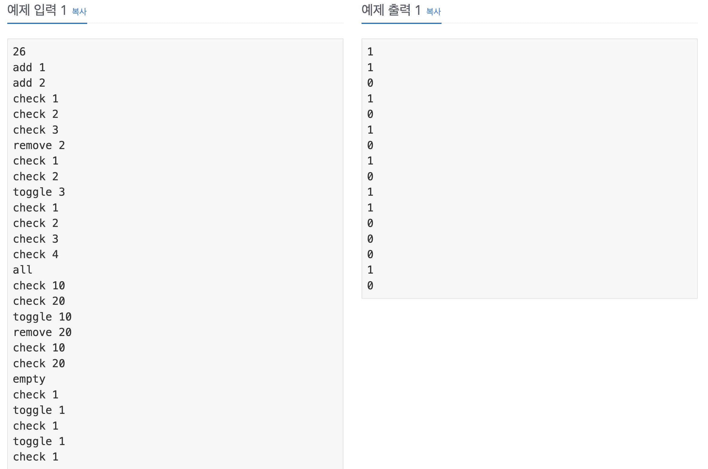

## 📖 [집합](https://www.acmicpc.net/problem/11723)
#### 📍 문제

---
#### 📍 풀이
- List를 통해 문제의 조건에 따른 연산을 구현했다.
---
#### 📍 느낀점
- 간단한 문제이지만 시간초과 때문에 조금 헤맸다. Sysout을 사용하면 출력할 때도 시간초과가 날 수 있기 때문에 이 경우 BufferedWriter를 사용하면 해결할 수 있다는 것을 깨달았다. 다양한 입출력 방식에 대해 알고 있으면 좋을 것 같다.