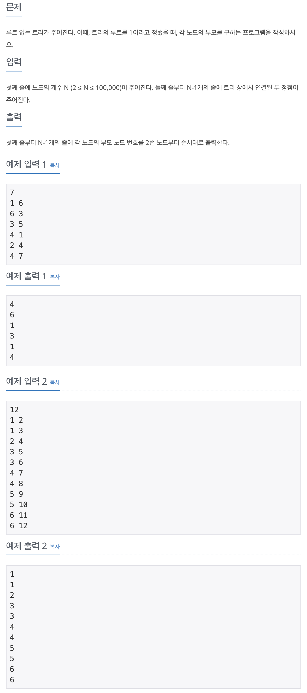

## 📖 [트리의 부모 찾기](https://www.acmicpc.net/problem/11725)

---
#### 📍 풀이
- BFS를 이용한 풀이
- 먼저 List형 배열에 인접한 노드를 입력받아 저장한다.
- i번 노드의 부모를 저장하는 배열 p를 선언 및 초기화한다.
- 최상위 루트는 항상 1이므로 Queue에 1을 먼저 삽입한다.
- BFS를 수행한다.
  - queue에서 노드를 꺼낸다. (current node)
  - adj[current node] List를 순회하며 인접한 node를 전부 탐색한다.
  - p[인접한 node]에 부모가 저장되어 있지 않다면, current node를 부모로 저장하고 인접 node는 queue에 삽입한다.
---
#### 📍 느낀점
- 쉬운 문제이지만 더 최적화할 수 있는 방법이 있는지 고민이 필요하다.