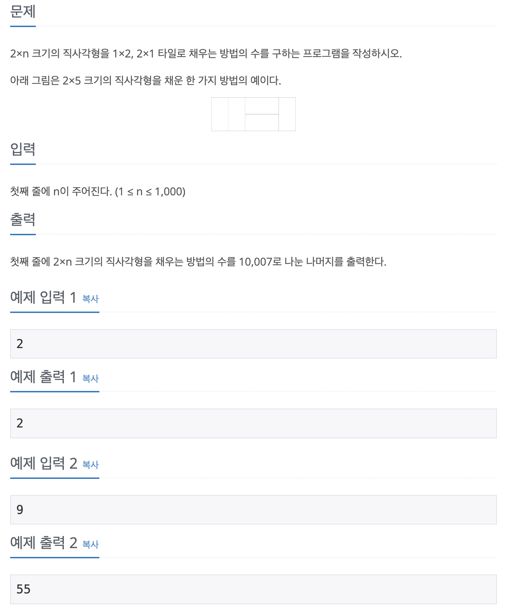
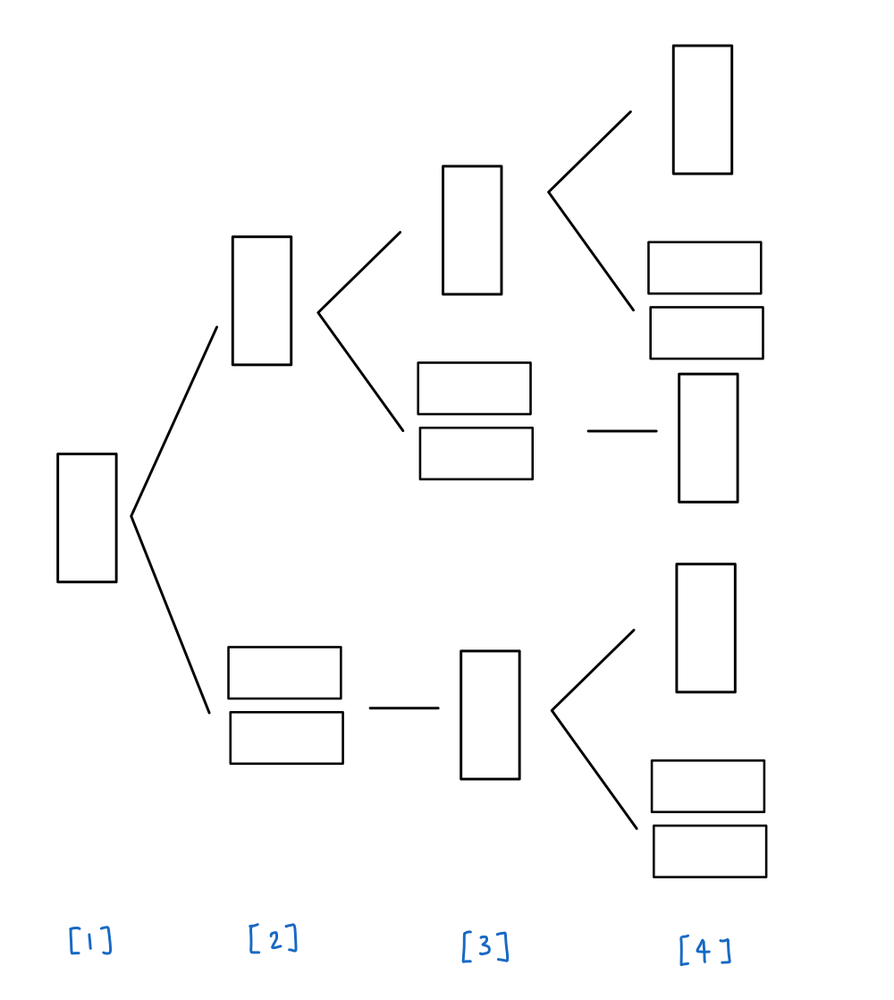

## 📖 [2xn 타일링](https://www.acmicpc.net/problem/11726)

---
#### 📍 풀이
- 기본적인 dp를 이용한 피보나치 수열 풀이
- n번째 크기의 직사각형을 채우는 방법은 n-1번째를 채운 직사각형의 모양에 따라 달라진다.
  
  - 이에 대한 규칙성을 찾으면 dp[n+2] = dp[n] + dp[n+1]
- 피보나치 수열에서는 항상 **오버플로에 유의해야 한다.**
  - n이 48일 때 부터 dp[n] 값은 int형을 넘어간다. 64비트 타입을 쓰더라도 n이 94일 때 부터 오버플로가 발생한다.
  - 해당 문제에서는 정답이 10007로 나눈 나머지이기 때문에 dp를 실행하며 10007이 넘을 때 마다 10007로 나눈 나머지를 저장했다.

---
#### 📍 느낀점
- 숫자가 무한히 커질 것 같을 때는 꼭 오버플로가 발생하는지 아닌지 따져보자. (long 타입을 쓴다고 해결되는 것이 아님)