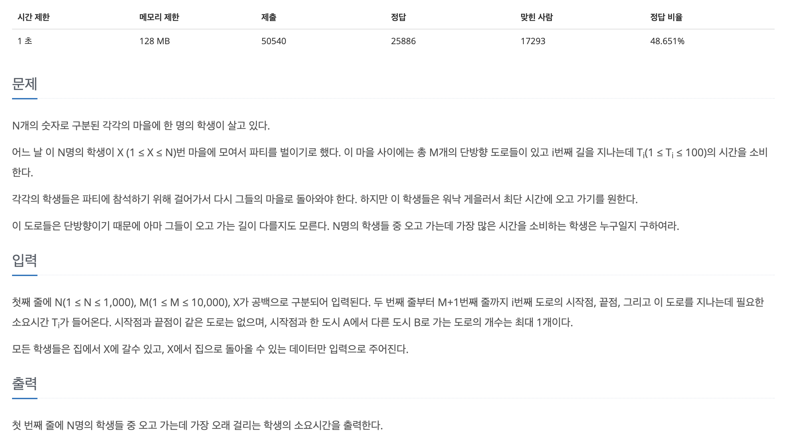

## 📖 [파티](https://www.acmicpc.net/problem/1238)
#### 📍 문제

---
#### 📍 풀이
- 모든 지점에서 다익스트라를 이용하여 왕복 최단거리를 구하였다.
- 주어진 점 X에서 다른 점으로 갈 때는 모든 점이 방문될 때 까지 다익스트라를 실행했고, 다른 점에서 주어진 점 X로 갈 때에는 X가 방문될 때 까지만 다익스트라를 실행했다.
---
#### 📍 느낀점
- 우선순위큐를 활용하면 시간을 단축시킬 수 있고, 더욱 효율적인 풀이가 가능한데 아직 반복문이 더 익숙해서 최대한 스스로 해결하려다 보니 반복문으로 풀게 되었다.
- 다음에 다시 우선순위큐로 풀어봐야겠다.