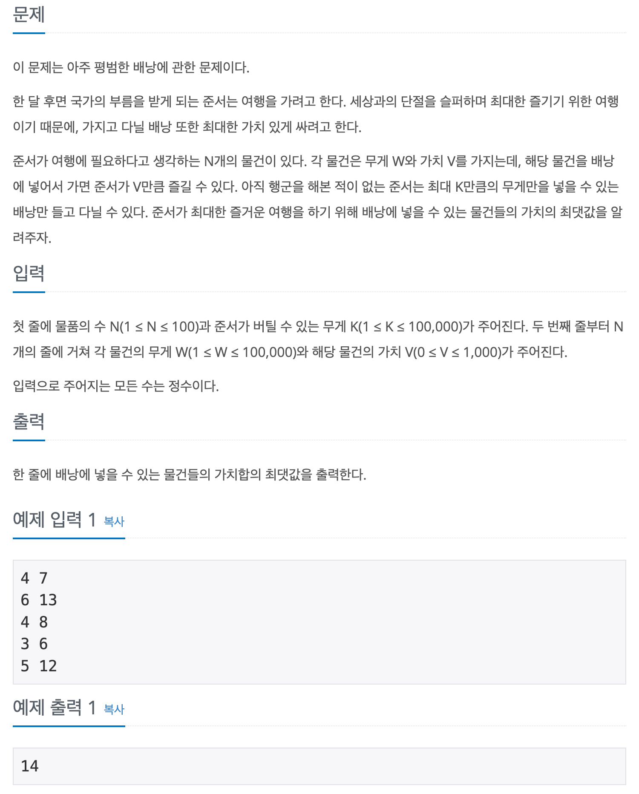

## 📖 [평범한 배낭](https://www.acmicpc.net/problem/12865)
#### 📍 문제

---
#### 📍 풀이
- 기본적인 dp를 이용한 knapsack 문제
- `[물건의 개수 + 1][가능한 무게 + 1]` 크기의 2차원 dp 배열을 만든다.
- 물건의 무게와 가치를 저장하는 2차원 배열을 만들고 저장한다.
- dp 배열을 탐색하며 최댓값을 비교 저장한다.
  - `dp[r][c]` => '(r - 1) 행, (현재 무게 - r번째  물건의 무게) 열에 저장된 값에서 r번째 물건의 가치를 더한 값'과 '(r - 1)행의 c열에 저장된 값' 중 최댓값을 찾아 저장한다.
  - 현재 열이 r번째 물건의 무게 보다 작을 경우에는 `dp[r - 1][c]` 값을 저장한다.
    - 처음에 이 부분을 간과해서 틀렸다.
    - 이 부분을 빼면 최적의 해를 찾지 못한다.
---
#### 📍 느낀점
- 이론 수업을 들은 이후로 혼자서는 처음 구현해보는데, 예시 없이는 풀기 어려워서 결국 규칙을 참고했다.
- dp 중 가장 기본 문제인데도 이렇게 헤맨걸 보니 비슷한 문제를 더욱 연습해야겠다. 특히 2차원 dp 문제에서 유형을 보지 않고 푸는 습관이 중요하다.