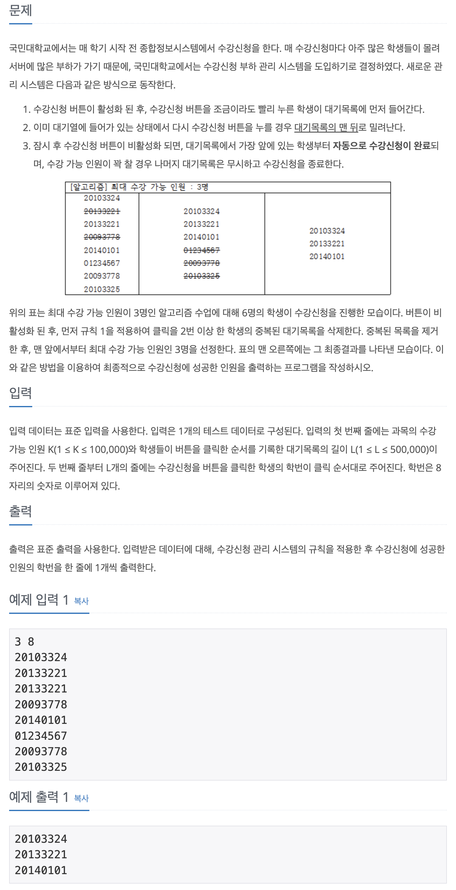

## 📖 [수강신청](https://www.acmicpc.net/problem/13414)

---
#### 📍 풀이
- HashMap의 정렬을 이용한 풀이
- key가 학번, value가 입력 순서인 HashMap을 선언하고 입력 받는다.
- HashMap의 key를 value에 대해 오름차순으로 정렬한다.
- cnt가 K와 같아질 때까지 key를 출력한다.
---
#### 📍 느낀점
- Map의 특징과 주요 메소드, 그리고 key와 value로 정렬하는 방법을 각각 암기하고 있어야겠다.