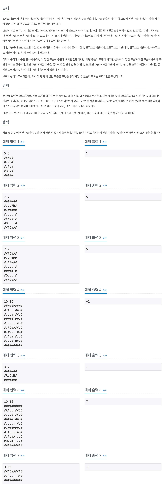

## 📖 [구슬 탈출 2](https://www.acmicpc.net/problem/13460)
#### 📍 문제

---
#### 📍 풀이
- BFS를 활용한 구현
- 상하좌우로 기울였을 때의 빨간 구슬의 위치와 파란 구슬의 위치, 기울인 횟수를 Queue에 더하며 BFS를 수행한다.
  - 파란 구슬이 빠져 나갈 경우는 제외한다.
- 기울였을 때의 빨간 구슬과 파란 구슬의 위치가 같을 경우, 이동한 칸 수가 더 많은 구슬을 한 칸 뒤로 보낸다. 
---
#### 📍 느낀점
- 처음에 문제 이해를 잘 못하고 풀어서 시간이 많이 소요됐다. 글만 읽었을 때 간과하는 부분이 있기 때문에 문제를 풀기 전 예제를 통해 시뮬레이션 하는 습관을 길러야겠다.
- 빨간 구슬과 파란 구슬의 위치가 같을 경우를 어떻게 처리할지 고민을 많이 했는데, 다른 풀이를 참조하지 않고 이동 칸수로 간단하게 해결할 수 있어서 뿌듯했다. 난이도가 골드1이라서 괜히 더 어렵게 생각한 것 같다.
- 메모리 낭비가 심해서 최적의 방법은 아닌 것 같은데, 더욱 고민해 봐야겠다.