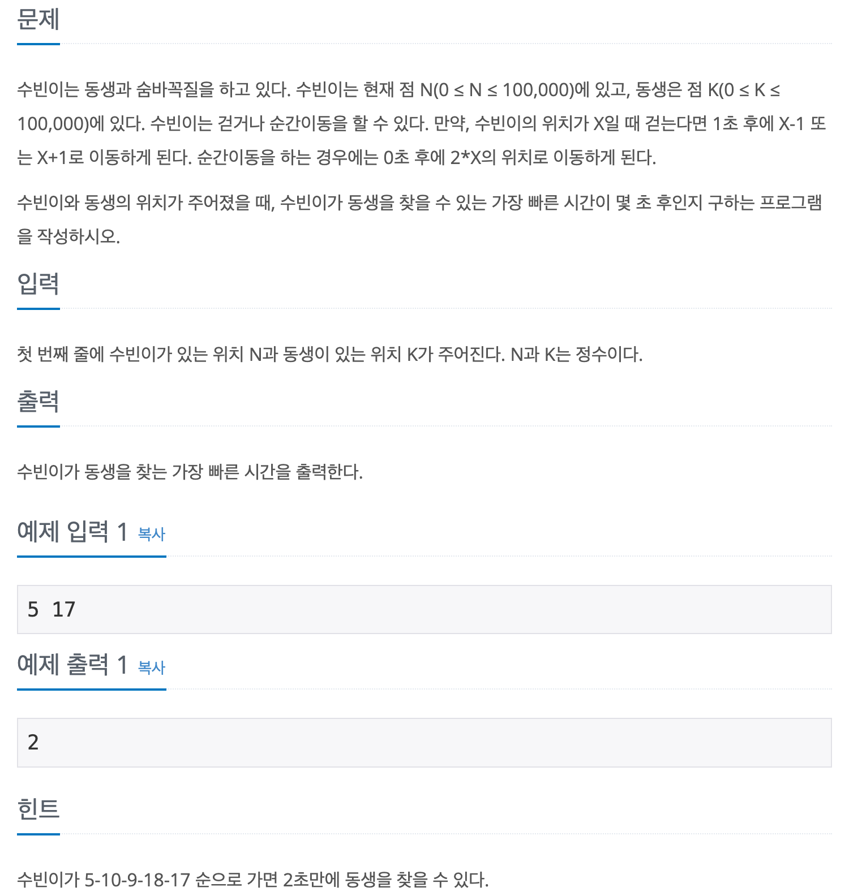

## 📖 [숨바꼭질 3](https://www.acmicpc.net/problem/13549)
#### 📍 문제

---
#### 📍 풀이
- BFS를 이용한 풀이
- N > K 인 경우는 뒤로가는 방법밖에 없으므로, `N - K` 출력
- 그 외엔 BFS를 실행하며 현재 위치에서 `*2`, `+1`, `-1`을 연산한 위치와 시간을 Queue에 삽입한다.
- 방문은 연산 3가지에 따라 총 3번 할 수 있으므로 방문 체크를 int형 배열로 실행한다.
  - 방문 횟수가 3이 넘으면 Queue에 삽입하지 않는다.
- 현재 위치가 K가 되면 최소 시간을 비교하여 갱신한다.
---
- 실수 1
  - 방문체크를 boolean으로 하여 최적 해를 도출하지 않음
- 실수 2
  - 현재 위치와 K가 같을 때 바로 while문을 종료함
  - 최소 시간으로 갱신하고, BFS는 계속 실행해야 최적해를 구할 수 있음
---
#### 📍 느낀점
- 알고리즘 분류를 알고 풀어서 풀이 방법을 쉽게 떠올리긴 했지만, 모르고 풀었다면 dp나 그리디로 해결하려고 하며 방향을 잡기 어려웠을 것 같다.
- Deque를 충분히 공부하고 다시 풀어봐야겠다.