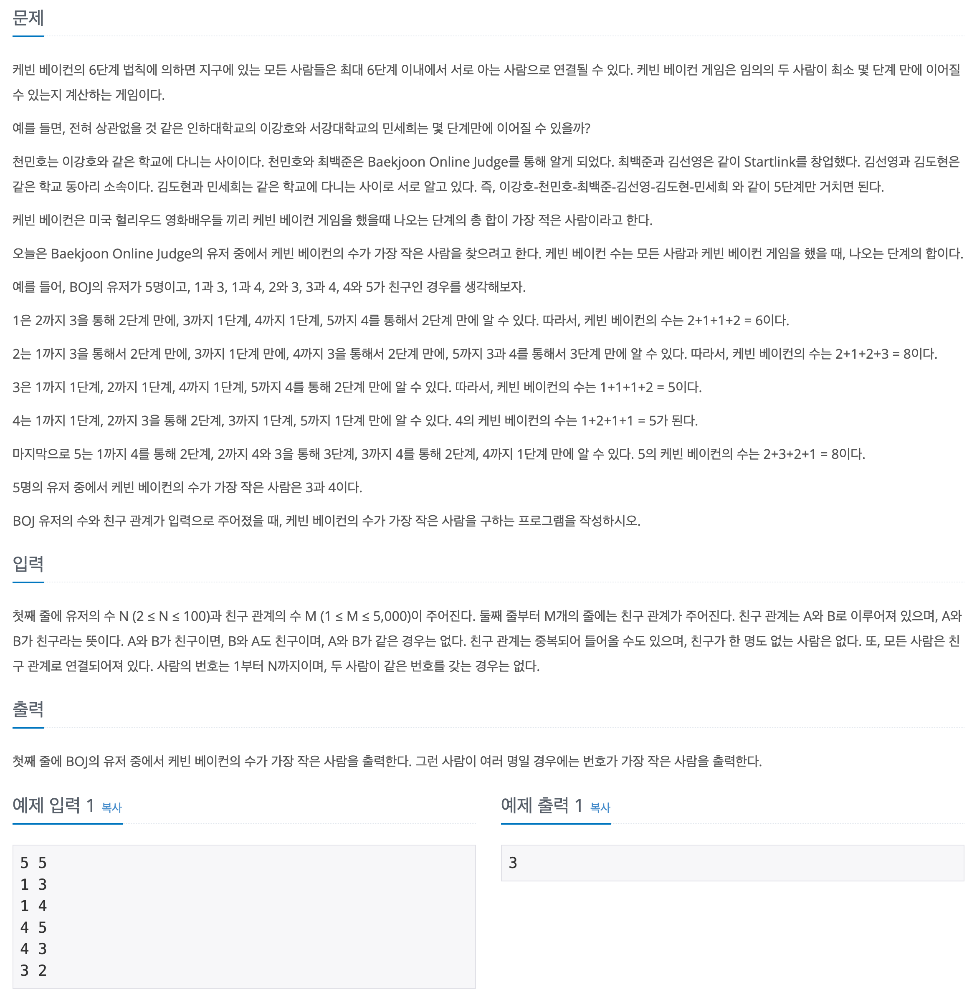

## 📖 [케빈 베이컨의 6단계 법칙](https://www.acmicpc.net/problem/1389)

---
#### 📍 풀이
- 인접 리스트와 BFS를 활용한 풀이
- `n`번째 사람의 인접 리스트를 순회하며 거치는 사람과 그 때의 최소 단계를 Queue에 저장하여 BFS를 시행한다.
- `N`번째 사람은 이미 앞선 시행에서 최소 단계를 모두 구할 수 있기 때문에 `minArr[N][N] = 0`으로만 초기화 하면 된다.
- 케빈 베이컨의 수가 가장 적은 사람을 구한다. (여러명일 경우에는 번호가 가장 적은 사람을 구한다.)

---
#### 📍 느낀점
- 문제에서 답이 여러개일 때 어떤 것을 출력하라고 했는지를 꼭 유의해서 보자.
- 코드가 복잡해지지 않게 하기 위해 `n`번째 사람을 방문할 때 마다 visited 배열을 새로 선언하고 초기화했는데, 처음부터 2차원 배열로 선언해서 방문 check를 하는 것이 더 효율적일 것 같다.
- 또 PriorityQueue를 사용해서 방문 단계를 기준으로 오름차순으로 정렬되도록 하면, Queue에서 꺼낼 때 바로 방문 check를 할 수 있으니 시간 복잡도를 개선할 수 있을 듯 한데 다음에 해당 방식으로 다시 풀이해봐야 겠다.