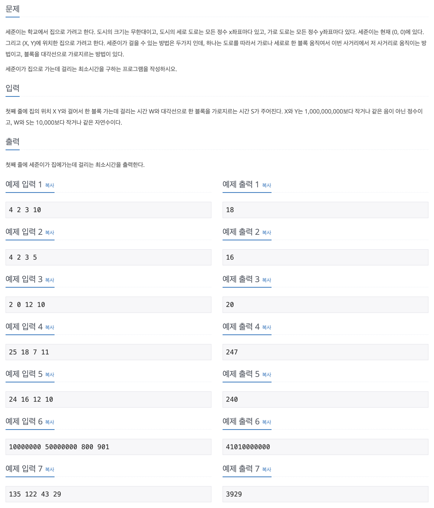

## 📖 [걷기](https://www.acmicpc.net/problem/1459)

---

#### 📍 풀이

- 단순 수식 계산 및 조건 구현 문제
- 정사각형 한 칸을 걸어갈 때 이동 시간 = `2 * w`
- 정사각형 한 칸을 가로질러 갈 때 이동 시간 = `s`
- 조건 1 : **한 칸**을 걸어가는 것이 가로질러 가는 것 보다 빠를 때 (`2 * w < s`)
  - 전부 걸어서 이동 (`(x + y) * w`)
- 조건 2 : 가로질러 가는 것이 **한 칸**을 걸어가는 것보다 빠를 때 (`2 * w > s`)
  - 조건 a : `x, y`의 차가 짝수일 때 -> 대각선만으로 이동 가능 (`(Math.max(x,y)) * s`)
  - 조건 b : `x, y`의 차가 홀수일 때 -> 마지막 한 변을 걸어서 이동 (`(Math.max(x,y) - 1) * s + w`)
- 조건 3 : 가로질러 가는 것이 **한 변**을 걸어가는 것보다 느리고, **한 칸**을 걷는 것보다는 빠를 때 (`w < s < 2 * w`)
  - 정사각형 만큼 가로질러서 이동 후, 나머지 변은 걸어서 이동 (`s * Math.min(x, y) + w * Math.abs(x - y)`)

- 실수 1 : 조건 2번의 경우를 생각하지 못하고 단순히 조건 1과 3으로 나누었다.
- 실수 2 : 조건 2에서 다시 조건 a와 b로 나뉘는 경우를 고려하지 못했다.

---

#### 📍 느낀점

- 대충 보고 쉬운 문제인 줄 알고 빨리 풀었는데 생각보다 조건 처리가 까다로운 문제였다. 심지어 초반에 계속 오답 처리가 나는데도 잘못된 부분을 발견하지 못했다.
- 문제 풀 때 바로 코드를 작성하기 보다는 꼭 발생 가능한 모든 케이스를 설계도록 하자.