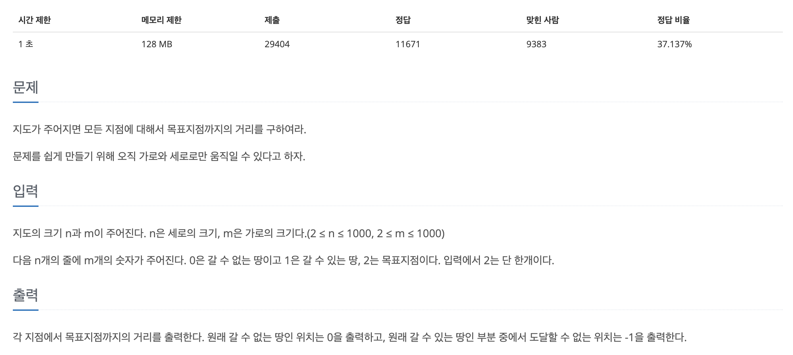
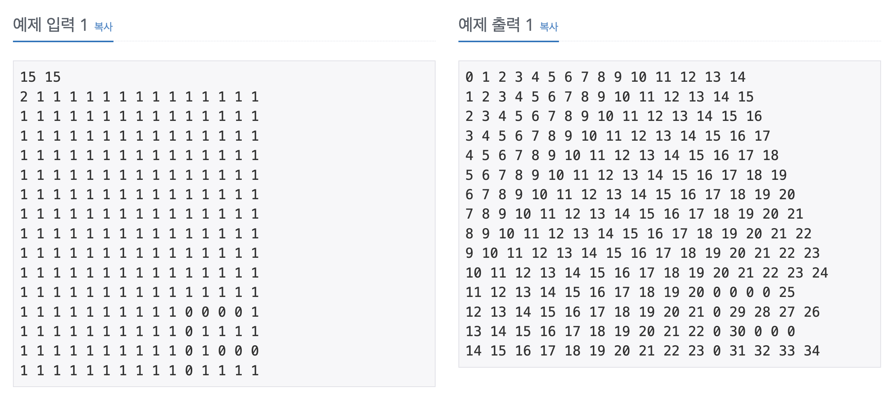

## 📖 [쉬운 최단거리](https://www.acmicpc.net/problem/14940)
#### 📍 문제

---
#### 📍 풀이
- inner class를 활용하여 현재 위치와 거리를 담는 객체를 만들었다.
- BFS를 구현하여 사방 탐색을 통해 현재 위치에서 이동 가능한 다음 위치를 찾고, Queue에 삽입했다. 
- visited가 false인 경우는 땅이지만 목적지에 도달할 수 없는 경우만 존재하게 하여 해당 인덱스의 배열 값을 -1로 변경했다. 
---
#### 📍 느낀점
- BFS 풀이 시간이 많이 줄어서 뿌듯하다. 