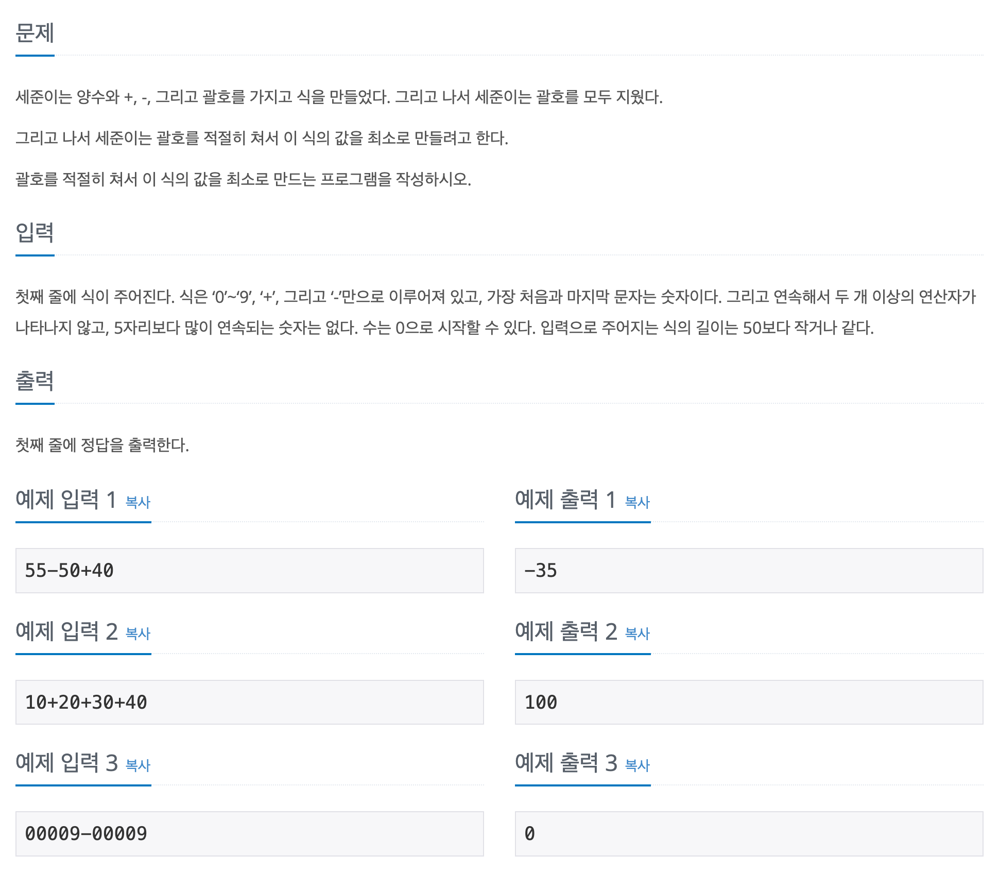

## 📖 [잃어버린 괄호](https://www.acmicpc.net/problem/1541)

---
#### 📍 풀이
- String 배열과 관련 메소드를 적절히 활용하여 푸는 문제
- `+` 기호는 괄호의 영향을 받지 않기 때문에 먼저 `-`를 기준으로 입력을 쪼갠다. (`minusNum` 배열)
- 쪼개진 각각의 수식에서 다시 `+`를 기준으로 분할하며 String을 Integer로 변환하여 전부 더한다. (`plusNum`배열)
- `minusNum`의 0번째 인덱스에서는 `sum`을 `ans`에 더하고 그 이후부터는 계속해서 뺀다.
---
#### 📍 느낀점
- 쉽게 생각하면 바로 풀리는 문제였는데 처음부터 더욱 간단한 메소드를 찾으려고 해서 설계에 시간이 오래 걸렸다.
- **split("+")이 정확히 `+` 기호 하나가 아니라, "1번 이상 반복되는 어떤 것"으로 해석되기 때문에** `\\`로 ***이스케이프 처리***를 해줘야 한다는 사실을 알게되었다.