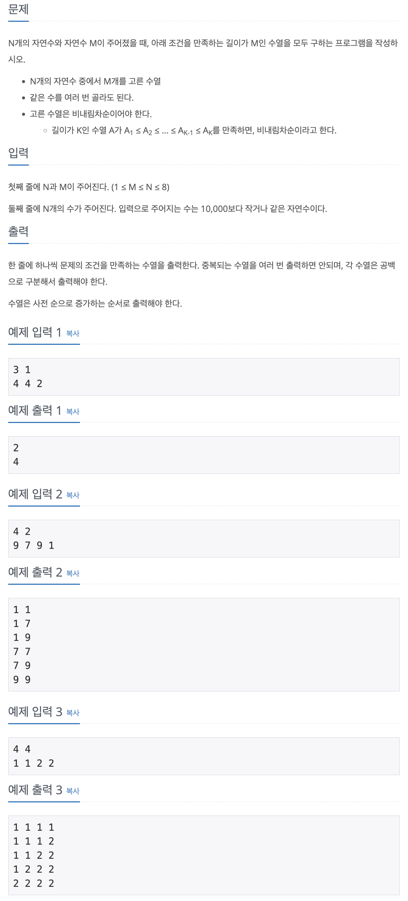

## 📖 [N과 M(12)](https://www.acmicpc.net/problem/15666)

---
#### 📍 풀이
- 기본적인 중복을 허용하는 순열 문제
- 입력 배열에 중복된 숫자가 포함되어 있으므로, sel배열에 숫자를 고를 때 arr[i]가 arr[i-1]와 같으면 해당 숫자는 고르지 않도록 처리했다.
---
#### 📍 느낀점
- N과 M(4)와 거의 똑같은 문제이지만, 이번 문제는 입력시에 중복을 허용하는 것이 달랐다. 입력받을 때부터 중복을 허용하지 않게 하는 것과 재귀 내부에서 중복을 판별하는 것에서 유의미한 시간 차이가 나지 않아 그냥 재귀에 조건문을 넣었다.
- 제발 처음부터 조건을 꼼꼼히 읽고 설계하도록 하자.