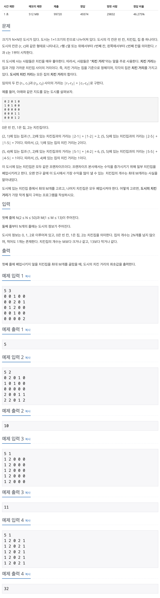

## 📖 [치킨 배달](https://www.acmicpc.net/problem/15686)
#### 📍 문제

---
#### 📍 풀이
- 조합을 통해 폐업하지 않는 치킨집을 고른다.
- 집들의 위치를 저장해놓은 List를 순회하며, 고른 치킨집들 중 최단거리를 구하여 더한다.
- 조합마다 반복하며 가장 짧은 거리(치킨 거리)를 구한다.
---
#### 📍 느낀점
- 처음에 최단 거리라고 해서 BFS라고 생각했다. 한 가지 키워드에 집착하지 않고 시간 복잡도를 고려해서 보다 쉽게 사고하는 능력을 길러야겠다.