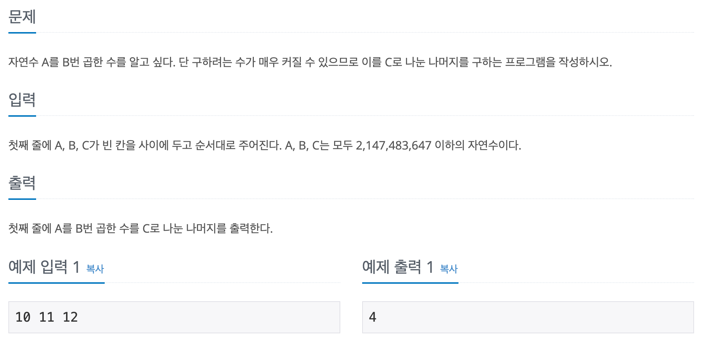

## 📖 [곱셈](https://www.acmicpc.net/problem/1629)
#### 📍 문제

---
#### 📍 풀이
- 분할정복을 이용한 거듭제곱 문제
- 세 수의 범위가 int형의 최댓값이기 때문에 모듈러 연산을 계속 수행하는 것이 중요한 문제이다.
  - B가 짝수일 때, tmp * tmp 가 범위보다 커지는 것을 방지하기 위해 모듈러 연산을 한번 실행하고, A를 곱한 후에 한 번 더 모듈러 연산을 실행해야 한다.
---
#### 📍 느낀점
- 자료형의 범위를 다루는 문제를 아직도 한 번에 맞히기가 어렵다. 😢