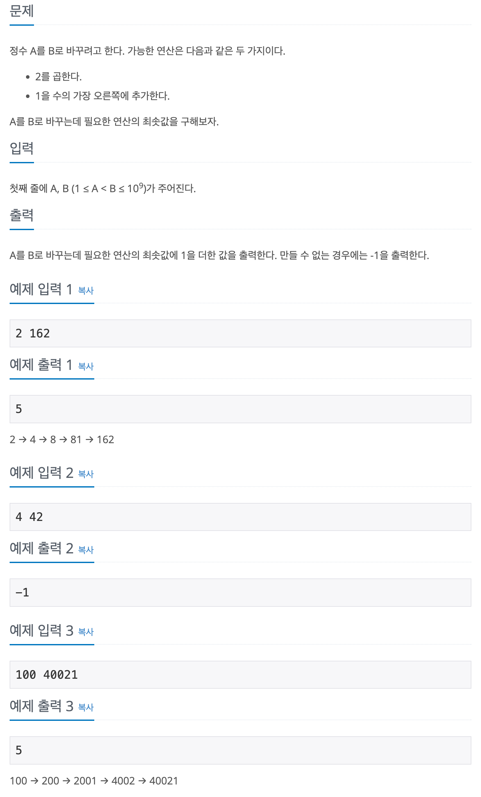

## 📖 [A -> B](https://www.acmicpc.net/problem/16953)

---
#### 📍 풀이
- 수식 구현 풀이
- B를 A가 될 때까지 반복하여 조건에 따라 연산을 수행한다.
  - 연산 결과가 홀수일 경우
    - 마지막 자리가 1이면 1을 제거 후 오른쪽으로 한 칸 씩 옮긴다.
    - 마지막 자리가 1이 아니면 2로 나누어지지 않기 때문에 불가능하다고 판단하여 연산을 종료한다.
  - 연산 결과가 짝수일 경우
    - 2로 나눈다.
---
#### 📍 느낀점
- 쉽다.ㅎㅎ