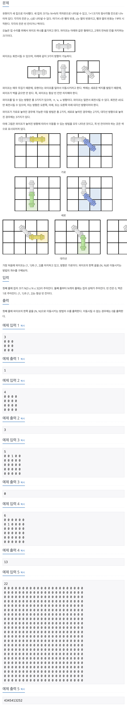

## 📖 [파이프 옮기기 2](https://www.acmicpc.net/problem/17069)
#### 📍 문제

---
#### 📍 풀이
- 3차원 dp 배열을 이용한 풀이
- `home[r][c]`에서 가로로 놓여있을 때
  - `home[r][c + 1]`, `home[r + 1][c + 1]` 방향으로 이동할 수 있는지 확인 하고, 이동할 수 있다면 
  - `dp[r][c + 1][0] += dp[r][c][0]`
  - `dp[r + 1][c + 1][2] += dp[r][c][0]`
- `home[r][c]`에서 세로로 놓여있을 때
  - `home[r + 1][c]`, `home[r + 1][c + 1]` 방향으로 이동할 수 있는지 확인 하고, 이동할 수 있다면 
  - `dp[r + 1][c][1] += dp[r][c][1]`
  - `dp[r + 1][c + 1][2] += dp[r][c][1]`
- `home[r][c]`에서 대각선으로 놓여있을 때
  - `home[r][c + 1]`, `home[r + 1][c]`, `home[r + 1][c + 1]` 방향으로 이동할 수 있는지 확인 하고, 이동할 수 있다면 
  - `dp[r][c + 1][0] += dp[r][c][2]`
  - `dp[r + 1][c][1] += dp[r][c][2]`
  - `dp[r + 1][c + 1][2] += dp[r][c][2]`
- ❗️ 실수
  - dp배열과 ans를 long 형으로 선언해야 하는데, int형으로 풀이해서 N이 커질 경우, 오답이 출력되었다.
  - 어떤 지점에 놓일 수 있는 경우가 3의 거듭제곱씩 증가하므로, 기하급수적으로 커지게 된다.
---
#### 📍 느낀점
- 파이프 옮기기 1을 풀면서 문제 유형을 보고 dp로 풀 수 있다는 걸 알게 되어 설계 자체는 어렵지 않았는데, 만약 보지 않았다면 내가 이 풀이를 바로 떠올렸을지는 모르겠다.
- 작은 문제들의 해가 큰 문제를 이룬다면 dp 풀이를 꼭 떠올려보자
- 그리고 꼭!! **dp 문제에서 특히 최대 경우를 생각하고, 자료형에 유의하자.** dp를 사용하는 이유가 빠르게 최대 경우를 찾기 위해서이기 때문에 유독 dp 문제에서 자료형 때문에 오답이 되는 경우가 많다.