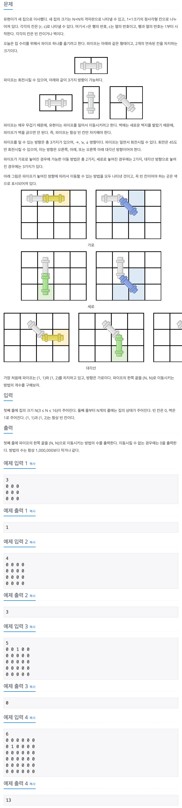

## 📖 [파이프 옮기기 1](https://www.acmicpc.net/problem/17070)
#### 📍 문제

---
#### 📍 풀이
- BFS를 이용한 풀이
- Queue에 파이프 끝 지점의 위치와 현재 방향의 상태를 함께 저장하여
  - 대각선 방향으로 미는 경우 
  - 현재 방향이 가로 or 대각선일 때는 가로 방향으로 미는 경우
  - 현재 방향이 세로 or 대각선일 때는 세로 방향으로 미는 경우
  - 위 세가지로 나누어 가능한 경우를 Queue에 삽입한다.
- `(N - 1, N - 1)`에 도착하면 ans에 1을 더한다.
---
#### 📍 느낀점
- 메모리가 매우 커서 최적화를 고민하며 여러 가지로 수정해 보았는데 방법을 찾지 못했다. DFS로 해결하는 것 밖에 없는지 고민해봐야 겠다.
- 같은 문제에 대한 DP 풀이는 [파이프 옮기기 2](https://github.com/sehaim/algorithm/tree/master/BOJ_Solution/src/boj_17069_파이프옮기기2) 참고 