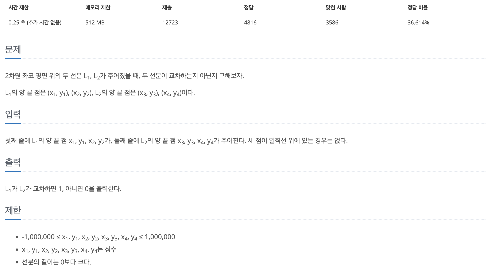
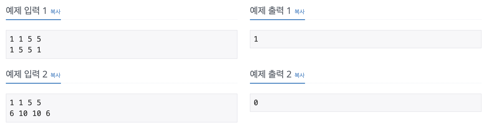

## 📖 [선분 교차1](https://www.acmicpc.net/problem/17386)
#### 📍 문제

---
#### 📍 풀이
- 두 가지 방법으로 풀이
- Main.java
  - 두 선분이 포함되는 직선의 방정식을 구하고, 이를 이용해 해결했다. 두 직선의 기울기가 다르며, 교점의 x좌표가 두 선분의 x좌표 범위 내에 위치하면 두 선분은 교차한다.
  - 한 직선이 x축에 수직인 경우에는 기울기의 분모가 0이므로 계산이 불가능하다. 따라서 이 경우는 따로 조건을 설정해 나머지 한 선분이 해당 선분의 x좌표를 지날 때, y좌표가 범위 내에 있는지 판단하여 교차 여부를 결정했다.
  - float형으로 설정하면 소수점 아래 자리의 범위 때문에 정확한 판단이 불가능하다. (50% 틀림)
- Main2.java
  - CCW 알고리즘을 이용한 풀이이다. 한 선분과 나머지 선분을 이루는 두 점의 방향(시계 방향/시계 반대 방향)을 판단했다.
  - 이 때 두 선분 각각에 대한 나머지 두 점의 방향이 모두 반대인 경우 두 선분은 교차한다. 
  - 역시 자료형이 중요하다. 
---
#### 📍 느낀점
- 직선의 방정식을 이용한 풀이에서는 처음에 모든 조건을 설정하지 못해 시간이 꽤 오래 걸렸다. 해당 문제처럼 조건 설정이 중요한 문제에서는 처음부터 최대한 모든 경우의 수를 판별하는 것이 중요한 것 같다. 
- 이번 문제로 CCW를 처음 알게 되었는데, 쓰임이 많은지는 잘 모르겠다. 그래도 새로운 접근법을 공부할 수 있어 좋았다. 
- 그러나 자료형은 아직도 왜 풀이대로 선언해야 하는지 아직 잘 모르겠다.. ㄴ