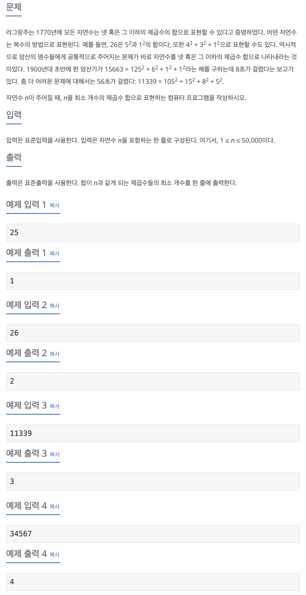

## 📖 [Four Squares](https://www.acmicpc.net/problem/17626)

---
#### 📍 풀이
- dp를 이용한 풀이
- `i`번째 수를 이루는 제곱수의 개수가 가장 최소가 되려면
  - `i`에서 `i`보다 작은 제곱수들을 차례로 하나씩 뺀다. (ex. `i - 1^2`, `i - 2^2`, `i - 3^2` ...)
  - 그 중 해당 수를 이루는 제곱수의 개수가 가장 최소인 것을 찾는다. (`i - j^2`)
  - `i`번째 수를 이루는 제곱수의 개수는 `i - j^2`번째 수를 이루는 제곱수의 개수에 1가지(`j^2`)가 추가된 것이다 
---
#### 📍 느낀점
- 문제 유형이 dp인 것을 몰랐으면 스스로 풀지 못했을 문제이다.
- 풀이를 생각했을 때 2중 for문이 들어가면 무조건 시간 초과일 것이라고 생각했는데, N이 50000이고, 50000보다 작은 제곱수의 최댓값은 223이기 때문에 약 천백만번 정도만 연산을 수행하면 된다.