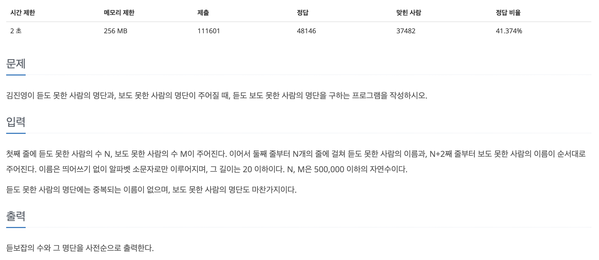
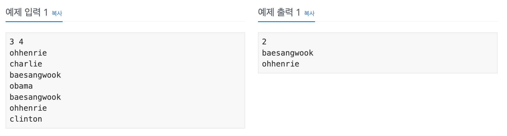

## 📖 [듣보잡](https://www.acmicpc.net/problem/1764)
#### 📍 문제

---
#### 📍 풀이
- Map을 이용한 풀이
- 듣도 못한 사람을 Map에 입력 후, 보도 못한 사람을 입력받으며 Map에서 찾는다.
- Map에 해당 이름이 있으면, 새로운 Map에 삽입한다. 
---
#### 📍 느낀점
- 굳이 TreepMap이 아니라 HashMap으로 통일해도 되는 문제였다. Map의 종류와 특징, 주요 메소드를 충분히 이해하고 암기하고 있어야 한다.