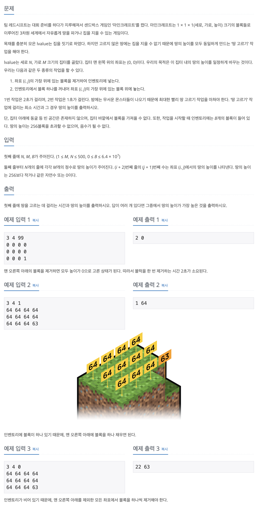

## 📖 [마인크래프트](https://www.acmicpc.net/problem/18111)

---
#### 📍 풀이
- 가능한 높이에 대해 완전 탐색 구현
- 가능한 높이는 배열의 최소 높이 ~ 최대 높이 이다.
- 최소 높이 ~ 최대 높이 i 에 대해 배열을 전부 순회하며 (시간 복잡도 최대 `O(256*500*500)`) i와 해당 자리의 높이의 차 diff를 계산한다.
- i가 더 클 경우에는 해당 위치에서 높이를 증가시켜야하므로 인벤토리에서 블록을 꺼낸다. 이 때 소요 시간은 `차이 * 1` 만큼 증가한다. 
- i가 더 작을 경우에는 해당 위치에서 높이를 제거해야하므로 인벤토리에 블록을 저장한다. 이 때 소요 시간은 `차이 * 2` 만큼 증가한다.
- 배열을 모두 순회 후, 인벤토리에 저장된 블록 b가 0보다 작을 때는 해당 높이로 고르게 하는 것이 불가능하므로 b가 0 이상일 때만 최소 시간을 구한다.
- 최소시간이 여러 경우일 때에는 높이가 가장 클 때를 출력한다.
- 실수
  - 실수 1
    - B를 i 탐색마다 매번 처음 입력값으로 초기화해줘야 하는데, 이 부분을 간과해서 틀렸었다.
  - 실수 2
    - 소요 시간을 차이만큼 곱해줘야 하는데 이 부분 역시 처음 설계할 때 간과했다.
  - 실수 3
    - 최소 시간이 여러 경우일 때, 높이를 최대로 갱신하는 로직에서 실수를 많이 했다. 무조건 Math.max / min 을 이용하려다 보니 최댓값 갱신을 어디서 해줘야할지 몰랐다. 이럴 때는 그냥 조건문으로 최솟값일 때 / 최솟값보다 작을 때 나누어서 직접 처리하는게 더 쉽고 간단하다. 
---
#### 📍 느낀점
- 그리디나 dp문제 같아서 고민을 많이 했으나, 결국 풀이를 참조해서 풀었다. 실버2 문제라서 쉬울 줄 알았는데 여러번 실수해서 푸는데 꽤 오래 걸린 문제였다. 또한 최소 시간이 여러 경우일 때 처리를 꼼꼼히 하지 못했다. 완전탐색 문제에서 꼭꼭 조건을 정리하고 처음부터 제대로 구현하는 법을 익혀야겠다.