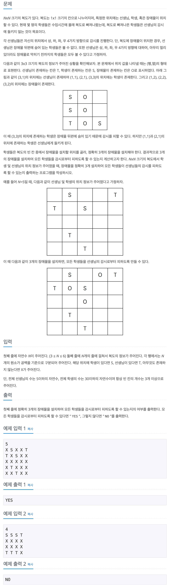

## 📖 [감시 피하기](https://www.acmicpc.net/problem/18428)
#### 📍 문제

---
#### 📍 풀이
- 브루트포스 + 백트래킹을 이용한 풀이
- 학생의 위치를 먼저 찾고, 해당 위치에서 상하좌우로 탐색하며 선생님을 찾는다.
- 만약 선생님이 존재한다면 학생과 선생님 사이의 위치를 전부 obstacles List에 저장한다.
- obstacles List에서 3가지를 골라 장애물을 설치하고, 이 때 모든 학생이 선생님의 감시를 피할 수 있는지를 확인한다.

- ❗️ **중요한 실수**
  - 장애물을 최대 3개까지 설치할 수 있으므로, sol 함수에서 s_idx가 3이 되면 check 함수를 실행하도록 했다. 그러나 이렇게 하면 장애물을 설치할 수 있는 위치가 3개 미만인 경우는 check가 불가능하다.
  - 따라서 obstacles의 size가 3 이하인 경우에는 무조건 "YES"를 출력하도록 했다.
---
#### 📍 느낀점
- 처음에 85%에서 오답 처리가 되어서 반례를 찾는데에 시간이 많이 걸렸다. 백트래킹 문제는 항상 풀고 나면 조건을 꼼꼼히 확인해야겠다고 생각하는데, 막상 또 새로 풀 때에 자꾸 간과하게 되는 것 같다. 설계할 때 꼭 문제에서 주어지지 않은 조건을 전부 메모해야겠다.
- 거리를 늘려가며 하는 사방탐색도 잊지 말자. 