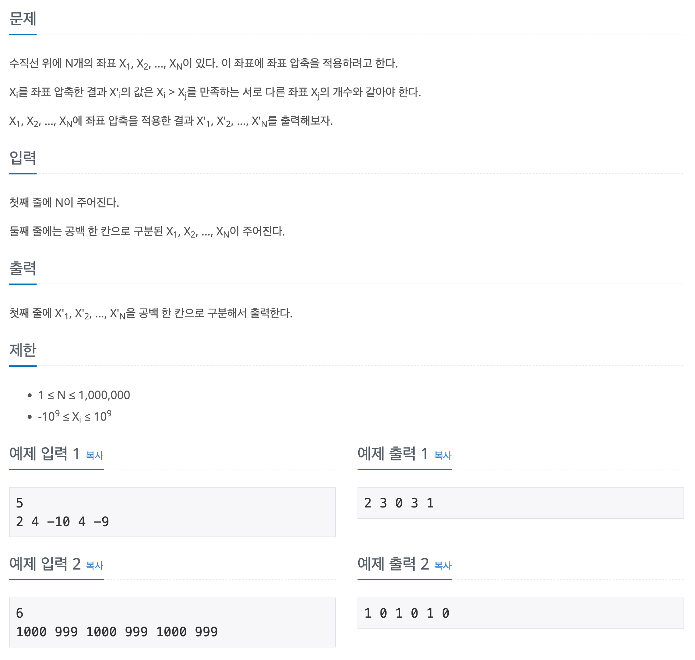

## 📖 [좌표 압축](https://www.acmicpc.net/problem/18870)
#### 📍 문제

---
#### 📍 풀이
- 정렬과 자료구조를 이용한 풀이
- 오름차순으로 배열을 정렬한 후, Map에 (값, 순위)를 저장한다.
- 정렬되지 않은 기존 배열을 순회하며 해당 값의 순위를 출력한다.
---
#### 📍 느낀점
- 처음에 배열을 정렬할 생각을 하지 않고 입력하는 대로 정렬이 되도록 TreeSet을 이용했더니, 오히려 set을 map으로 변환하고 순위를 저장하는 과정에서 시간이 더 오래 걸렸다.
- 이번 문제를 계기로 map의 주요 메서드의 시간 복잡도를 정확히 알게 되었다. 앞으로 유의해서 문제를 풀어야겠다.