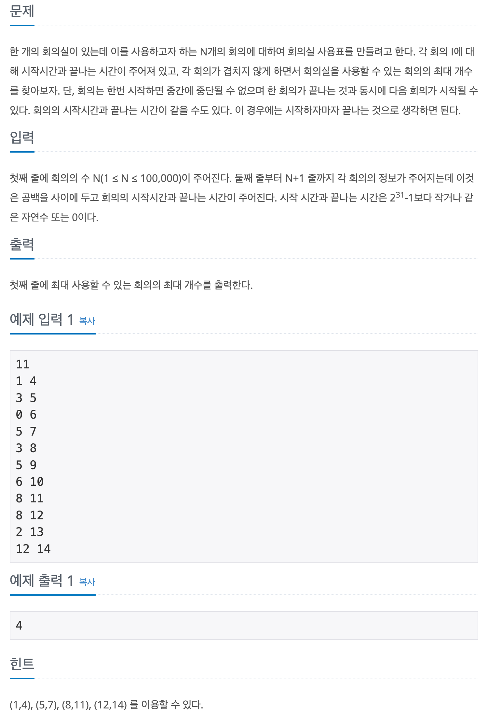

## 📖 [회의실 배정](https://www.acmicpc.net/problem/1931)

---
#### 📍 풀이
- 그리디 알고리즘
- 회의의 시작 시간은 항상 끝나는 시간보다 작거나 같을 수 밖에 없기 때문에 끝나는 시간을 기준으로 정렬한다.
- 끝나는 시간에 대해 오름차순으로 정렬된 리스트를 순회하며, 새로운 회의의 시작시간이 현재까지 누적된 끝나는 시간보다 크거나 같으면 해당 회의를 시작한다. (끝나는 시간을 해당 회의의 끝나는 시간으로 갱신)
---
#### 📍 느낀점
- 처음에 시작하는 시간이 기준이 되어야 한다는 생각에 쉽게 그리디 풀이를 떠올리지 못했다. 시간복잡도가 O(N)이 넘으면 안되는 문제에서는 그리디를 꼭 떠올리자. 