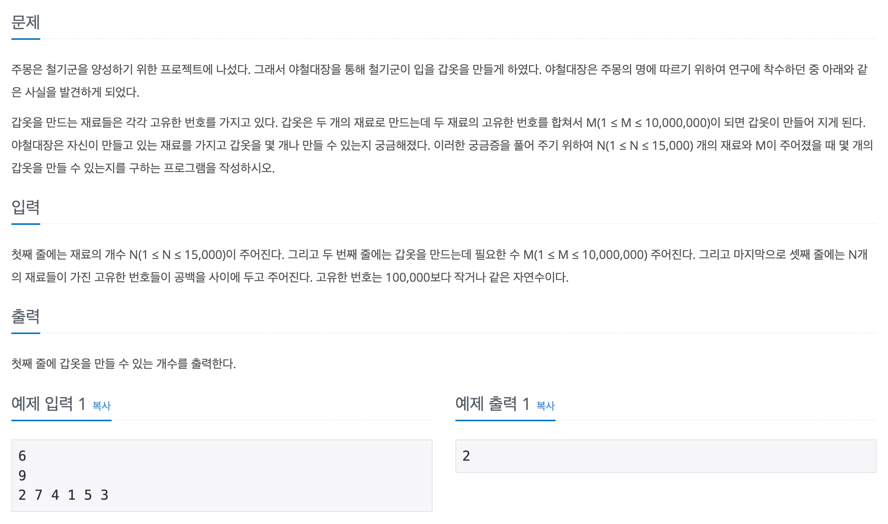

## 📖 [주몽](https://www.acmicpc.net/problem/1940)

---

#### 📍 풀이

- 투 포인터를 활용한 풀이
- 정렬된 배열에서 두 수의 합이 `M`이 되는 지점을 찾는다.
  - 합이 `M`보다 작으면 왼쪽 포인터를 오른쪽으로 한 칸 이동해야 수가 커진다.
  - 합이 `M`보다 크면 오른쪽 포인터를 왼쪽으로 한 칸 이동해야 수가 작아진다.
  - 합이 `M`이면 정답의 개수를 1 증가시킨 후 두 개의 포인터 모두 안쪽으로 한 칸 씩 이동시킨다.

---

#### 📍 느낀점

- 마이다스 코딩테스트에서 유사한 문제를 해결하지 못해서 종료 후 해당 문제를 찾아서 풀어 보았다. 투 포인터 문제인 걸 알고 풀어서 그런지 생각보다 너무 간단한 문제라 풀이를 떠올리지 못한 것이 아쉽다.
