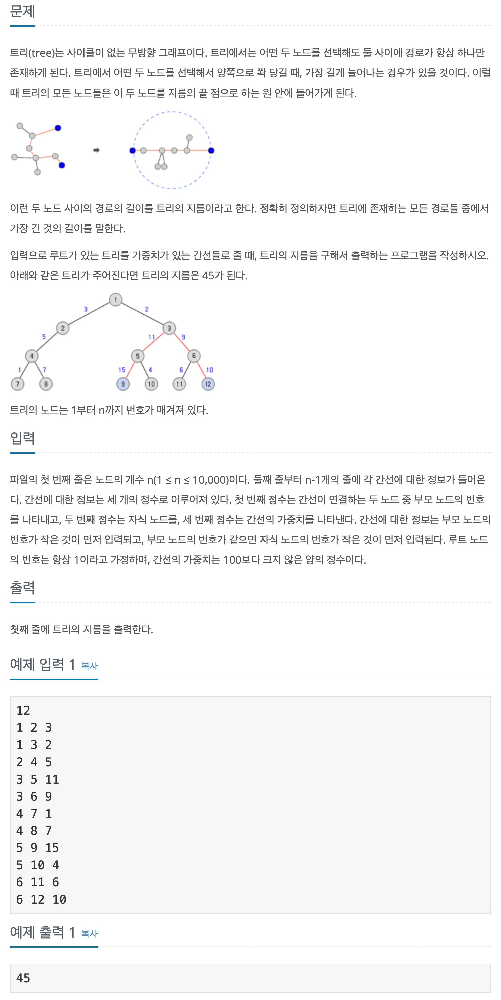

## 📖 [트리의 지름](https://www.acmicpc.net/problem/1967)
#### 📍 문제

---
#### 📍 풀이
- Dijkstra를 이용한 풀이
- 임의의 정점에서 가장 거리가 먼 정점 n1을 구한 후, 다시 정점 n1에서 가장 거리가 먼 정점 n2를 구한다. n1에서 n2 사이의 거리가 트리의 지름이다.
---
#### 📍 느낀점
- 트리의 지름에 대한 이론을 학습한 적이 있어 쉽게 풀 수 있는 문제였다.