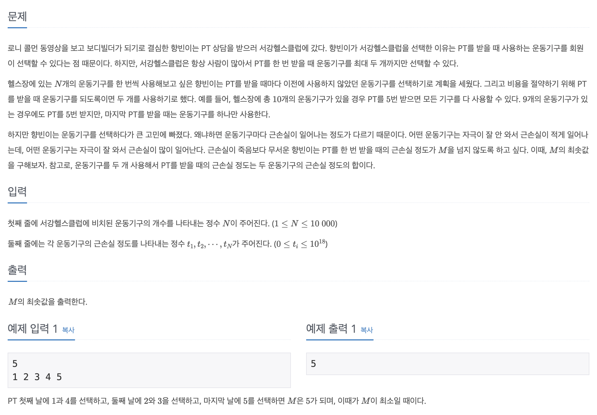

## 📖 [서강근육맨](https://www.acmicpc.net/problem/20300)

---
#### 📍 풀이
- 정렬 후 투 포인터를 활용한 풀이
- 주어진 배열에서 두 수의 합의 최댓값이 최소가 되어야 한다. 이를 위해 먼저 배열을 정렬하고, 가장 왼쪽과 가장 오른쪽에서 한 칸 씩 이동하며 최댓값을 찾는다.
    - `N`이 홀수일 경우, 근손실이 가장 큰 운동기구를 단독 사용하므로 이를 조건부로 처리한다.
- 주어진 수들의 차가 어떻든, 하루 근손실 합이 최소가 되기 위해서는 근손실이 가장 큰 운동기구와 근손실이 가장 작은 운동기구를 같은 날 사용해야 한다. 같은 원리로 정렬했을 때 대칭된 위치에 있는 운동기구를 하루에 사용한다.
---
#### 📍 느낀점
- 쉬운 문제인데 포인터를 사용한다는 개념을 잊어버려서 난이도에 비해 고민을 오래 한 것 같다.
- 다양한 접근 방식의 그리디 문제를 풀어봐야겠다.