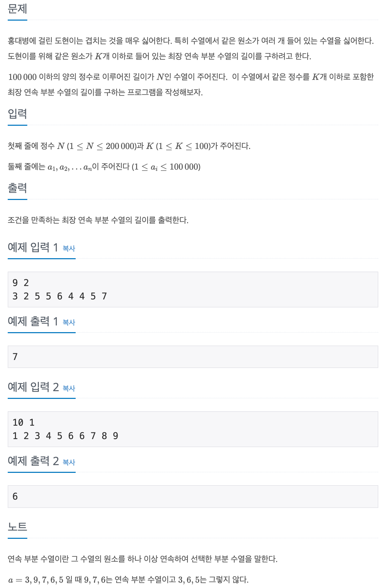

## 📖 [겹치는 건 싫어](https://www.acmicpc.net/problem/20922)

---
#### 📍 풀이
- 투 포인터를 이용한 풀이
- 오른쪽 포인터를 이동하며 해당 포인터가 가리키는 수의 개수를 증가시킨다.
- 증가시킨 수의 개수가 K를 넘을 경우 오른쪽 포인터는 가만히 두고 왼쪽 포인터를 이동시킨다.
- 왼쪽 포인터를 이동하며 원래 가리키고 있던 수의 개수를 감소시킨다.
- 감소시킨 수의 개수가 K일 경우 왼쪽 포인터의 이동을 중단한다.
- 오른쪽 포인터를 이동할 때 마다 수열의 길이의 최댓값을 비교, 갱신한다.
---
#### 📍 느낀점
- 이 전에 비슷한 문제를 풀었어서 풀이가 바로 떠올랐다. 전위 증가와 후위 증가에 유의하면서 풀어 실수 없이 바로 해결할 수 있었다.