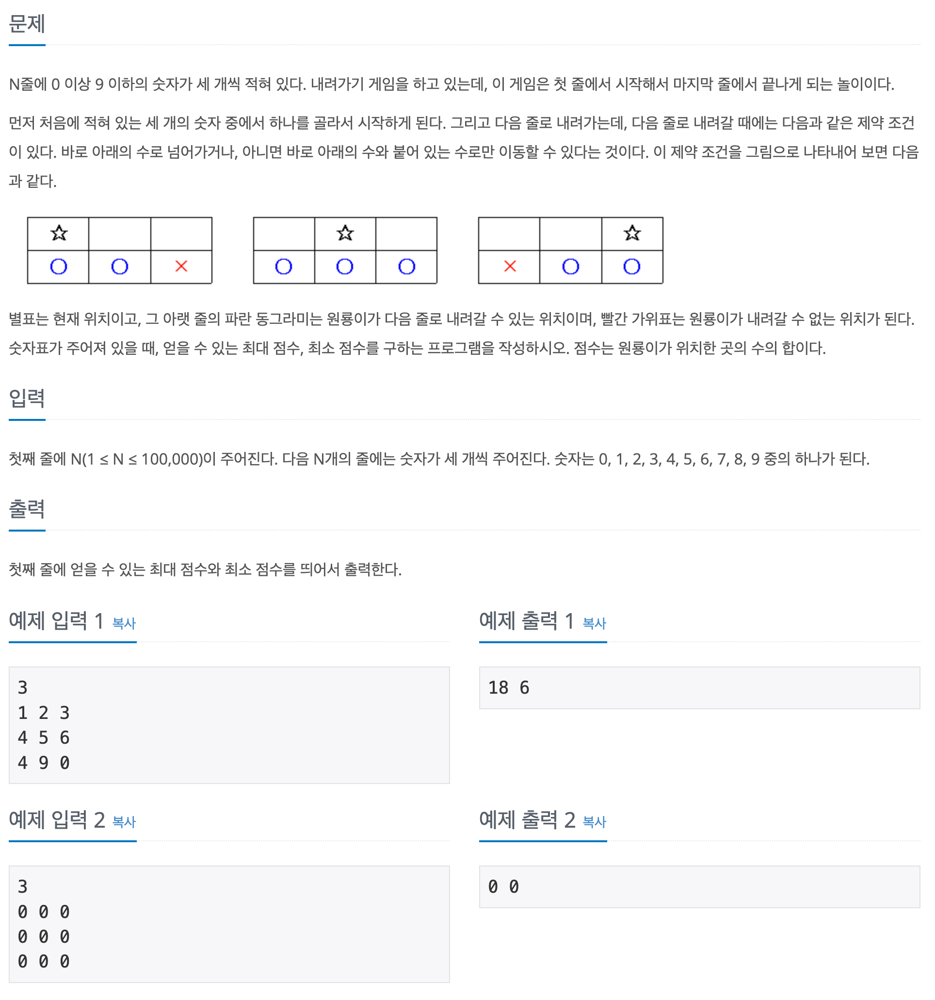

## 📖 [내려가기](https://www.acmicpc.net/problem/2096)
#### 📍 문제

---
#### 📍 풀이
- 3차원 dp 배열을 이용한 풀이
  - 해당 자리에서 얻을 수 있는 점수의 최댓값과 최솟값을 함께 저장하기 위함
- r 행의 c 번째 열로 갈 수 있는 경우의 수 중 최소, 최댓값
  - c = 0 일 경우
    - r-1 행의 0, 1번째 열 중 최소, 최댓값
  - c = 1 일 경우
    - r-1 행의 0, 1, 2번째 열 중 최소, 최댓값
  - c = 2 일 경우
    - r-1 행의 1, 2번째 열 중 최소 최댓값
- 최종적으로 최소, 최대 점수는 N-1 행의 모든 열 중 최솟값, 최댓값이다.
---
#### 📍 느낀점
- 모든 자리에서의 최댓값과 최솟값을 함께 저장하면서 dp를 수행해야 하는 것을 파악하면 어렵지 않은 문제였다.