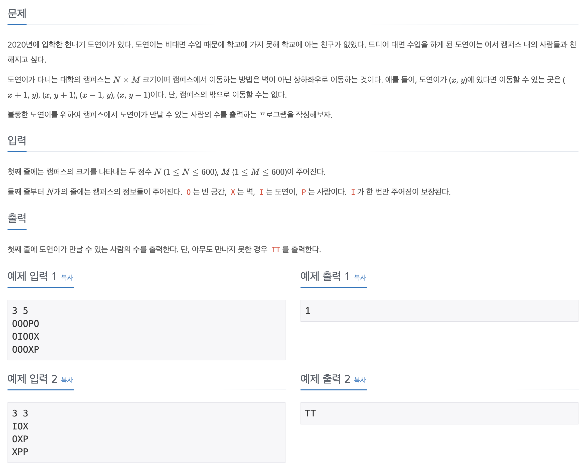

## 📖 [헌내기는 친구가 필요해](https://www.acmicpc.net/problem/21736)

---
#### 📍 풀이
- 기본적인 2차원 배열 BFS 풀이
- 도연이의 위치에서 상하좌우로 이동하며 BFS를 시행한다.
  - 이동한 위치가 벽이 아닐 경우에만 Queue에 삽입한다.
  - 사람을 만날 겅우 `ans + 1`을 시행한다.
- `ans = 0`이면 `TT`를 출력한다.

---
#### 📍 느낀점
- BFS 구현 방법만 정확히 알고 있다면 쉬운 문제이다.