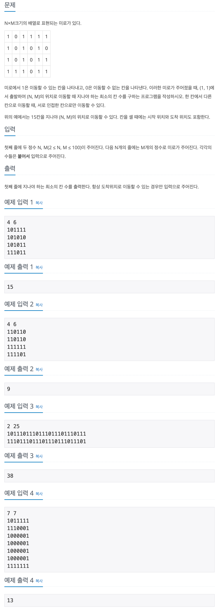

## 📖 [미로 탐색](https://www.acmicpc.net/problem/2178)

---
#### 📍 풀이
- 기본적인 BFS 풀이
- Node class를 만들어 해당 Node 까지의 거리를 저장할 수 있도록 했다.
---
#### 📍 느낀점
- 첫 풀이에서 방문 체크를 Queue에서 Node를 꺼낼 때 마다 실행했더니 메모리 초과가 되었다. Queue에 삽입할 때 방문 체크를 해주지 않으면 Queue가 계속해서 쌓이는 경우가 있으니 주의하자. 기본적인 사항인데 오랜만에 암기해서 풀다보니 어이없는 실수를 했다.