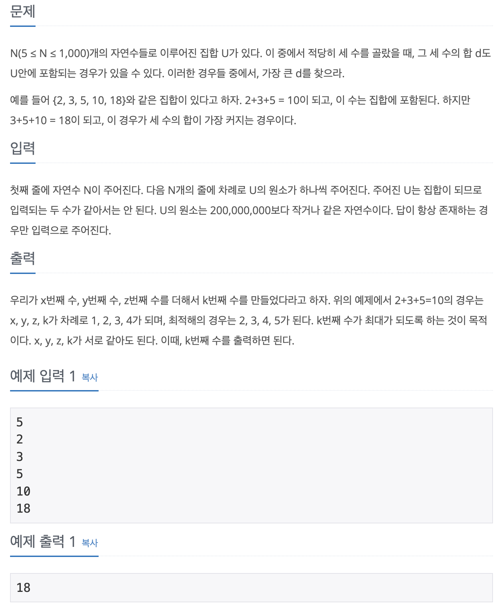

## 📖 [세 수의 합](https://www.acmicpc.net/problem/7662)

---
#### 📍 풀이
- `x + y + z = k` 를 `x + y = k - z`  로 생각하여 Set을 이용해 풀이했다.
- `x + y`의 모든 경우를 set에 입력하고 다시 `k - z`의 모든 경우를 탐색하며 set에 존재한다면 출력하도록 했다.
- 처음에 문제에서 x, y, z, k가 같아도 된다는 것을 간과해서 정답 풀이대로 풀면 반례가 존재한다고 생각했다.
- 또 문제에서 정렬된 상태로 입력이 주어진다는 말이 없었는데, 예제만 보고 착각하여 정렬을 실행하지 않아 오답 풀이를 제출했다. 
---
#### 📍 느낀점
- set이 아니라 배열에 저장해서 이분탐색으로 찾아도 가능한데, 문제 유형에 해시와 맵이 포함되어 있어서 너무 거기에 매몰된 것 같다.
- 그리고 문제 조건을 제발 꼼꼼히 읽자.