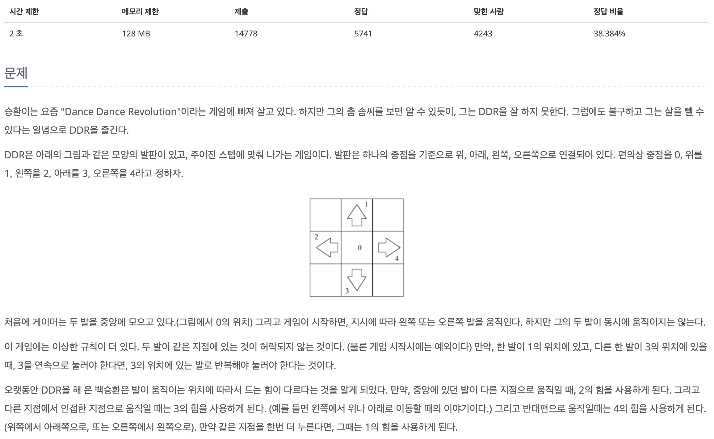
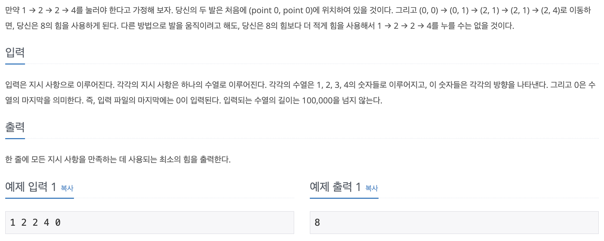

## 📖 [Dance Dance Revolution](https://www.acmicpc.net/problem/2342)
#### 📍 문제

---
#### 📍 풀이
- DP를 이용한 풀이
- 현재 위치에서 이동 가능한 모든 왼발과 오른발 위치에 대해 DP를 수행하며 최솟값을 찾는다. 
---
#### 📍 느낀점
- DP인걸 알고 풀었음에도 너무 어려웠다. 3차원 배열은 직관적으로 이해하기 힘들다고 느껴서 BFS 문제를 제외하고 일부러 안썼었는데, 이 문제는 오히려 3차원 배열을 쓰는게 가장 직관적이라고 생각했다.
- 언뜻 보기에는 그리디 문제로 오해할 수 있고, 나도 반례를 보기 전까지는 그럴 것 같았지만 가능한 모든 경우를 탐색하는 DFS + DP 혼합 문제 느낌이다.
- DP 문제에서는 DP를 수행할 배열을 어떻게 설계하고, 어떤 값과 비교해야 하는지가 가장 중요한 단서임을 잊지 말자.