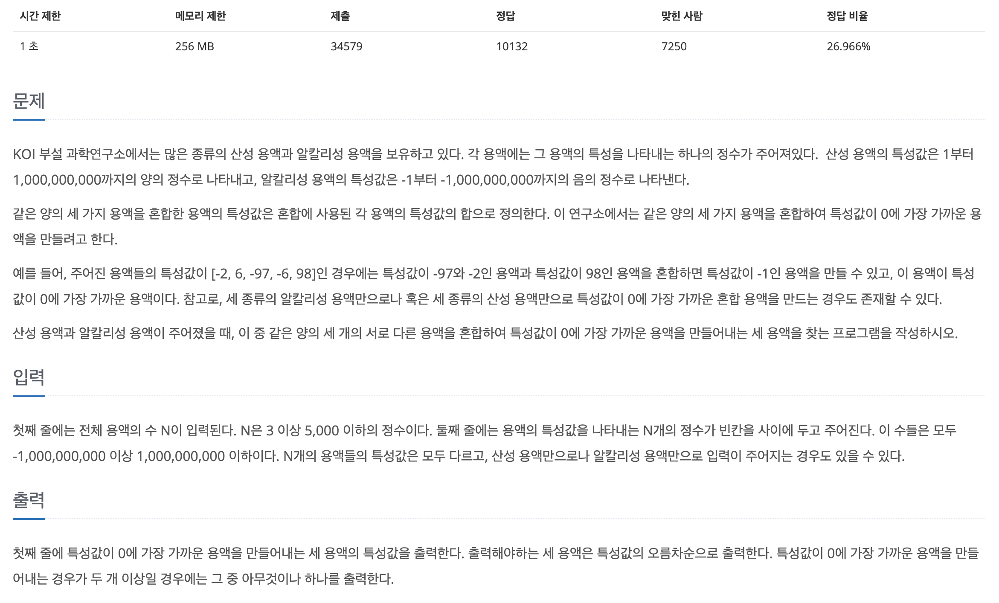
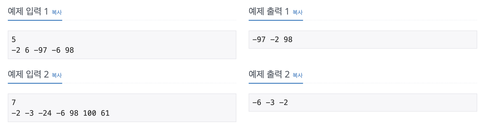

## 📖 [세 용액](https://www.acmicpc.net/problem/2473)
#### 📍 문제

---
#### 📍 풀이
- 투 포인터를 이용한 풀이
  - left 포인터는 현재 선택된 첫 번째 용액 다음부터 시작하고, right 포인터는 배열의 끝에서 시작하여 세 용액의 합을 계산하고, 이 합이 0에 더 가까운 경우 결과를 갱신한다.
  - 합이 0보다 작으면 left 포인터를 증가시키고, 0보다 크면 right 포인터를 감소시킨다.
---
#### 📍 느낀점
- 