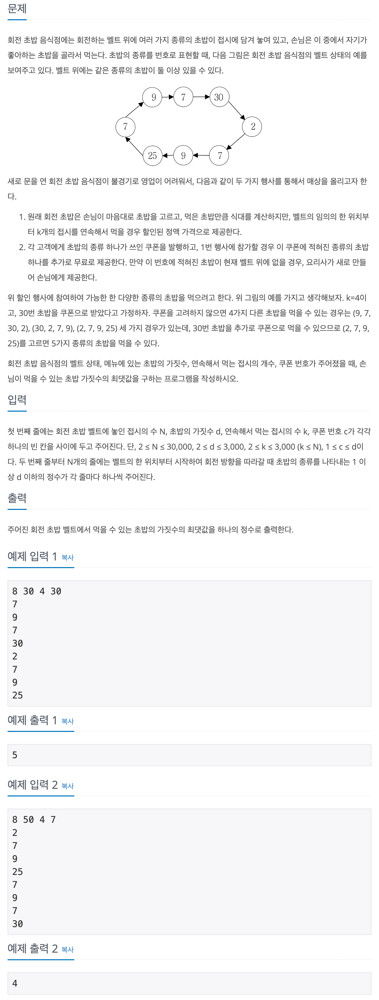

## 📖 [회전 초밥](https://www.acmicpc.net/problem/2531)

---
#### 📍 풀이
- 투 포인터를 이용한 풀이
- dish 배열 전체를 차례로 탐색하며, 왼쪽 포인터가 이동할 때 마다 원래 가리키고 있던 접시의 개수는 감소시키고, 오른쪽 포인터가 이동할 때 마다 새롭게 가리키고 있는 접시의 개수는 증가시킨다.
- 왼쪽 포인터가 가리키고 있던 접시의 개수를 감소했을 때, 0이 되면 먹을 수 있는 접시의 종류도 1 감소한다.
- 오른쪽 포인터가 새롭게 가리키는 접시의 개수가 0이었으면, 먹을 수 있는 접시의 종류도 1 증가한다. 
- 쿠폰으로 먹을 수 있는 접시 C는 초기에 개수(`sushi[C]`)를 1로 설정하여 번거롭게 따로 계산하지 않는다.
- 포인터를 이동할 때 마다 종류 kind의 최댓값을 비교 갱신핟다.
---
#### 📍 느낀점
- 구현 자체는 쉬운데, 문제를 읽고 바로 투 포인터가 떠오르지 않았다. 이분탐색과 마찬가지로, 관련 문제를 많이 풀어서 유형을 익혀야한다.
- 언제 어떤 인덱스를 변화시키고, 어떤 배열값을 변화시켜야 할지 초기 설계를 통해 먼저 시뮬레이션 해야 실수할 확률이 줄고 디버깅도 쉽다.