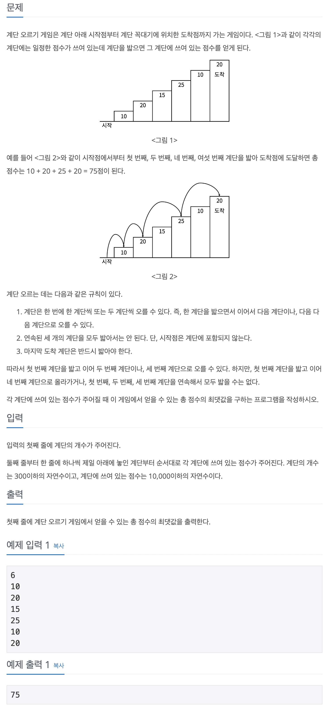

## 📖 [계단 오르기](https://www.acmicpc.net/problem/2579)

---
#### 📍 풀이
- 기본적인 dp 풀이
- [n번째 계단에 도달하는 경우]는 [(n-1)번째 계단에서 올라오는 경우] 또는 [(n-2)번째 계단에서 올라오는 경우] 두 가지가 있다. 따라서 두 경우 중 최댓값을 dp 배열에 저장한다.
- (n-1)번째 계단에서 올라오는 경우 = dp[n-3] + n-1번째의 점수 + n번째의 점수
- (n-2)번째 계단에서 올라오는 경우 = dp[n-2] + n번째의 점수
---
#### 📍 느낀점
- dp문제는 쉬운 것도 항상 다른 사람의 풀이나 방정식을 참고해서 풀었는데, 이번에 처음으로 규칙을 찾아 풀었다. 쉬운 문제지만 그래도 뿌듯하다.😁